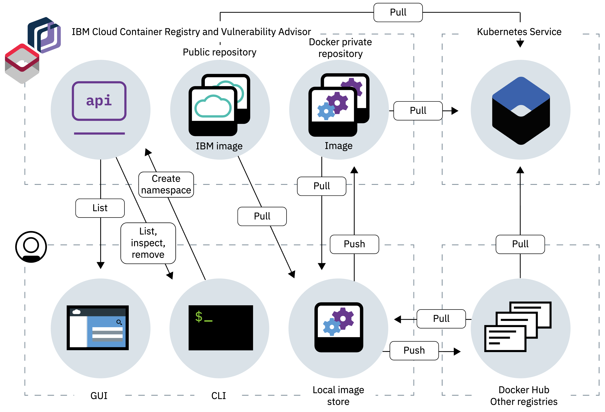

# Part 1: Securing your IBM Cloud Kubernetes Service workloads by using IBM Cloud Container Registry

Use IBM Cloud Container Registry to safely store and access private Docker images in a highly available and scalable architecture.

IBM Cloud Container Registry provides a multi-tenant, highly available, and scalable private image registry that is hosted and managed by IBM. You can use the private registry by setting up your own image namespace and pushing Docker images to your namespace.

## Features

### Highly available and scalable private registry

Set up your own image namespace in a multi-tenant, highly available, scalable private registry that is hosted and managed by IBM.

Securely store your private Docker images and share them with users in your IBM Cloud account.

### Security

Integrated with Identity and Access Management (IAM) to provide fine-grained access controls to users within your IBM Cloud account.

Vulnerability scanning, deployment policy enforcement, and comprehensive risk assessment and prioritization provide security compliance insight and controls over static images and live containers.

Uses Notary technology to store trusted content; allows you to control and mandate signatures for your images.

Images are encrypted in transit and at rest in IBM Cloud Object Storage.

### Integration

IBM Cloud preferred image registry; pre-integrated with IBM Cloud Kubernetes Service for your DevOps workflow by using IBM Open Toolchain or your existing CI/CD toolset.

## Audience

Although prior experience of operating Kubernetes and of using IBM Cloud Container Registry would be beneficial, this section of the lab is suitable for any user that wants to learn how to use IBM Cloud Container Registry to secure IBM Cloud Kubernetes Service workloads.

## Objectives

The different sections in this part of the lab will show you how to:

* Start using IBM Cloud Container Registry to store your Docker images
* Secure access to your private registry by using IAM
* Configure a Kubernetes cluster so that you can run images from your private registry
* Use Vulnerability Advisor to view information about vulnerabilities in your images
* Install Container Image Security Enforcement and prevent vulnerable images from running in your cluster
* Sign images in your private registry by using Docker Content Trust, and then use Container Image Security Enforcement to prevent unsigned images from running in your cluster.

## Duration

The estimated time to complete this part of the lab is 1 hour.
