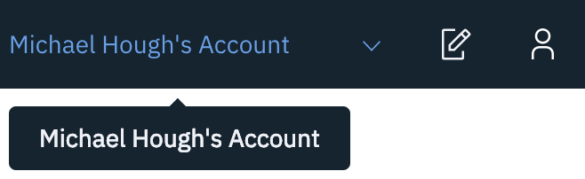
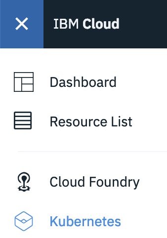

# Viewing vulnerability information about your images

In this section, you will use Vulnerability Advisor to scan your image. Vulnerability Advisor compares the packages in your image against lists of known vulnerabilities, and allows you to view a report on your image. You can define policies to control whether an image should be allowed to be deployed to your cluster, which you will experience in a later section.

## Viewing your image in Vulnerability Advisor

1. Open the IBM Cloud console and log in to your account. <https://cloud.ibm.com>

2. Make sure that the account selector in the top-right corner is set to your account.

    

3. Open the sidebar by clicking the menu icon in the top-left corner and then select Kubernetes.

    

4. In the left pane, select Registry.

5. Click Images.

6. Find your image (`registry.ng.bluemix.net/my_namespace/hello-world`) in the list. Note that the security status shows issues with the image. Click on the security status to view more information.

7. The issues view shows vulnerabilities and configuration issues that were detected with your image. In this case, your image contains some vulnerable packages.

## Resolving vulnerabilities

In order to resolve these vulnerabilities, we will re-build the image using a more recent version the Alpine base image than the one that was used in the initial image.

1. Navigate your terminal to the folder where your Dockerfile is stored.

    ```bash
    cd ~/myimage
    ```

2. Open the Dockerfile.

    ```bash
    open Dockerfile
    ```

3. Edit the FROM line to pull from the latest `alpine`. Then save and close the editor.

    ```Dockerfile
    FROM alpine
    ```

4. Rebuild the image, tagging it `latest` instead of `3.6` this time.

    ```bash
    docker build -t registry.ng.bluemix.net/my_namespace/hello-world:latest .
    ```

5. Log in to IBM Cloud Container Registry as yourself.

    ```bash
    ibmcloud cr login
    ```

6. Push your new image.

    ```bash
    docker push registry.ng.bluemix.net/my_namespace/hello-world:latest
    ```

7. Go back to the Images view in the console. Your new image is shown with no issues.

    If your image shows "Scanning", refresh the page until the vulnerability scan has completed.

    If your image still shows vulnerability issues, please bring this to the attention of the IBMers. You need an image without vulnerabilities in the next section.

## Recap

You have explored and remediated vulnerabilities in your image.

For some images, you might want to acknowledge the vulnerabilities and deploy the image anyway. You can create exemptions to allow deployment of certain images with certain vulnerabilities in them.

## Further reading

[Managing image security with Vulnerability Advisor (IBM Cloud Docs)](https://console.bluemix.net/docs/services/va/va_index.html#va_index)

[Setting organizational exemption policies (IBM Cloud Docs)](https://console.bluemix.net/docs/services/va/va_index.html#va_managing_policy)

## Next

In the next section, you will use Container Image Security Enforcement to control which images can be deployed into your cluster.
