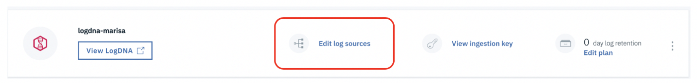
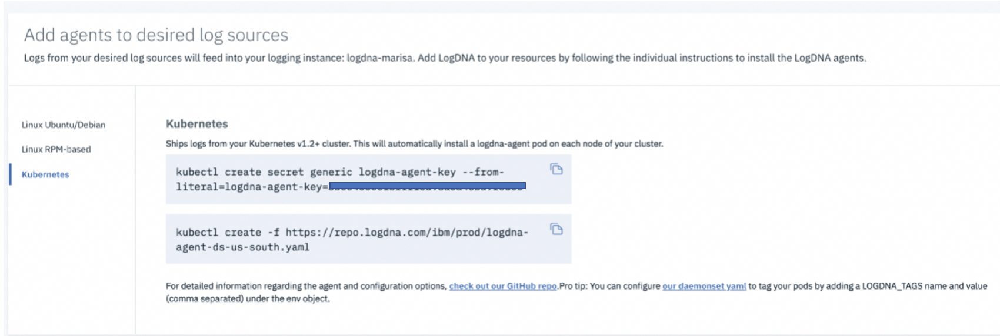

# Configure a Kubernetes cluster to forward logs to your logging instance {#configure-a-kubernetes-cluster-to-forward-logs-to-your-logging-instance}

Open a terminal in your local environment and complete the following steps to configure a LogDNA agent on a Kubernetes cluster that runs in the IBM Cloud Kubernetes Service:

### 1. Log in to IBM Cloud{#1}

Log in to IBM Cloud. Run the following command:

```
ibmcloud login -a api.ng.bluemix.net
```

**Note**: If you have a federated ID, use `ibmcloud login --sso` to log in to the IBM Cloud.

### 2. Set up the cluster environment{#2}

1. List the clusters. Run the following command:

    ```
    ibmcloud ks clusters
    ```

2. Set the resource group where the cluster is available. Run the following command:

    ```
    ibmcloud target -g ResourceGroupName
    ```

    You can run the command `ibmcloud ks cluster-get ClusterName` to find out the resource group.

3. Set the region where the cluster is available. Although you have logged in to the us-south region, you must set the region as part of setting the command line to work with the IBM Cloud Kubernetes service.

    ```
    ibmcloud ks region-set us-south
    ```

4. Get the command to set the environment variable and download the Kubernetes configuration files. 

    ```
    ibmcloud ks cluster-config CLUSTERNAME
    ```
    When the download of the configuration file is finished, a command is displayed.  

5. Copy and paste that command in your terminal to set the KUBECONFIG environment variable.


**Note:** Every time you log in to the IBM Cloud Kubernetes Service CLI to work with clusters, you must run these commands to set the path to the cluster&#039;s configuration file as a session variable. The Kubernetes CLI uses this variable to find a local configuration file and certificates that are necessary to connect with the cluster in IBM Cloud. 

### 3. Deploy the LogDNA agent{#3}

From the _Observability_ dashboard, select **Edit sources**.



The _Add agents to desired log sources_ window opens:



Complete the following steps to deploy the logdna agent for Kubernetes:

1. Select **Kubernetes**.

2. Copy the first command and run it in your terminal. In this step, you create a Kubernetes secret to store your logDNA ingestion key for your service instance. 

    The LogDNA ingestion key is used to open a secure web socket to the logDNA ingestion server and to authenticate the logging agent with the logging service. 
    
    The command looks as follows:

    ```
    kubectl create secret generic logdna-agent-key --from-literal=logdna-agent-key=<logDNA_ingestion_key>
    ```

3. Copy the second command and run it in your terminal to create a Kubernetes daemon set to deploy the LogDNA agent on every worker node of your Kubernetes cluster. 

    The LogDNA agent collects logs with the extension _*.log_ and extension-less files that are stored in the _/var/log_ directory of your pod. 
    
    The command looks as follows:

    ```
    kubectl create -f https://repo.logdna.com/ibm/prod/logdna-agent-ds-us-south.yaml
    ```

### 4. Verify that the LogDNA agent is running{#4}
    
Check that the pods are running. Your cluster has two workers running, therefore, you should see two logdna-agent pods.
    
Run the following command:

```
kubectl get pods
```

To check that the secret containing the access key has been created, you can run the following command:

```
kubectl get secrets
```

What logs can you expect to see?

*   Stdout and stderr logs from all containers
*   Application logs
*   Worker (node) logs

By default, logs are collected from all namespaces, including _kube-system_, and automatically forwarded to the logging service.

