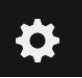
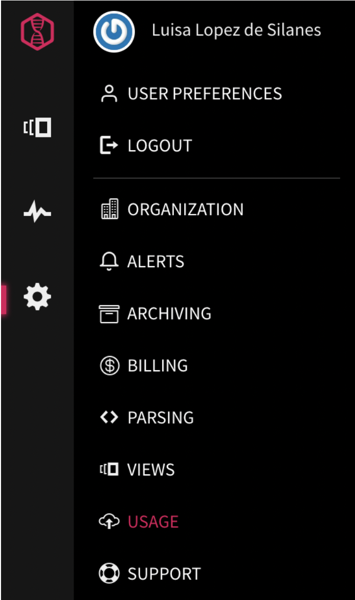
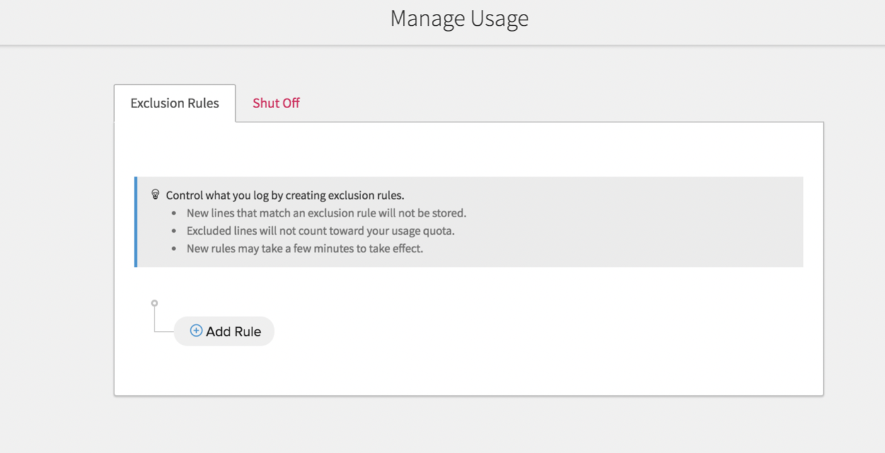
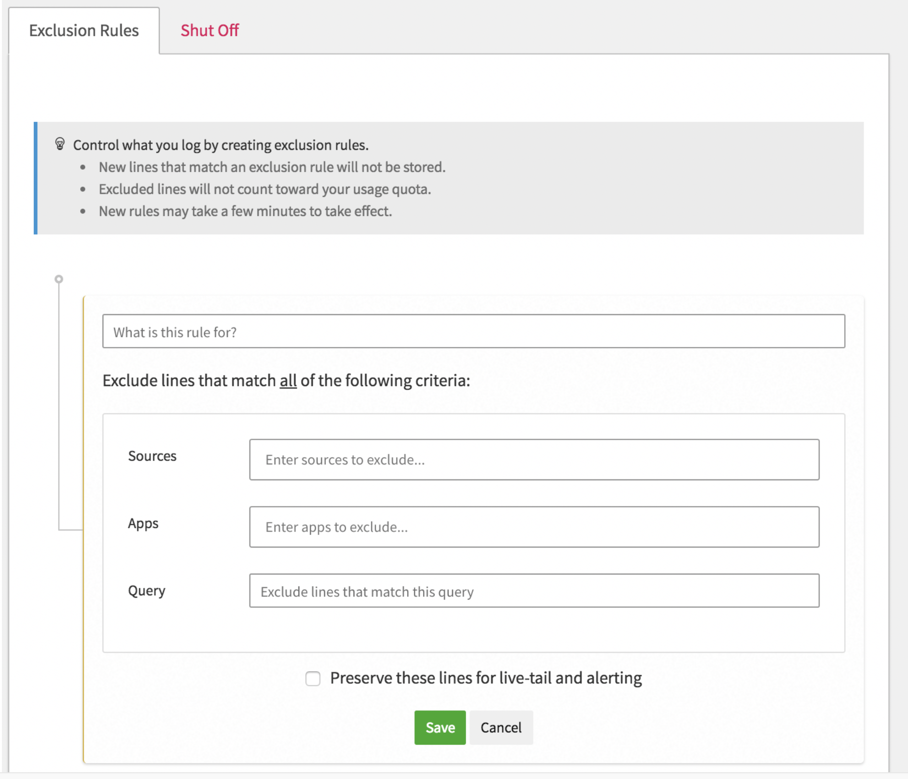
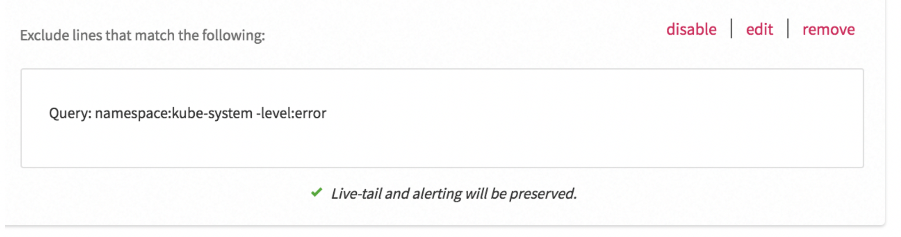

# Filter out kube-system logs from storage in a cluster except error entries {#filter-out-kube-system-logs-from-storage-in-a-cluster-except-error-entries}

In this step, you will learn how to exclude kube-system data from the cluster while keeping entries that report errors only. You will configure the rule so that you are able to see all log data through views and be able to define alerts on all the data.

Complete the following steps:

1. Select the settings icon .

2. Select **USAGE**.

    

    The _Manage Usage_ page opens.

    

3. In the **Exclusion Rules** section, select **Add rule**.

    

4. Enter the following query in the **Query** field:

    ```text
    Namespace:kube-system -level:error
    ```

    
