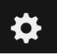

# Filter out log data from storage for a worker except error entries while keeping visibility of all lines {#filter-out-log-data-from-storage-for-a-worker-except-error-entries-while-keeping-visibility-of-all-lines}

In this step, you will learn how to exclude syslog data for a worker while keeping entries that report errors only. You will configure the rule so that you are able to see all log data through views and be able to define alerts on all the data.

Complete the following steps:

1. Select the settings icon .

2. Select **USAGE**.

    

    The _Manage Usage_ page opens.

    

3. In the **Exclusion Rules** section, select **Add rule**.

    

4. In the _Sources_ field, press spacebar and choose one. The list of options is displayed. Press spacebar again to get the list and add additional sources.

    In this lab, choose the source that ends with **w1**.

    Exclude lines that match all of the following criteria:

    

5. In the _Apps_ section, press spacebar and choose one. The list of options is displayed. Press spacebar again to get the list and add additional sources.

    Select **syslog**.

    

    

6. In the _Query_ section, enter **-level:error** to exclude all lines except the ones that report an error.

    

7. Click **Preserve this lines for live-tail and alerting.**

8. Click **Save**. Changes take a few minutes to be applied to the instance.

Notice that because the option **Preserve this lines for live-tail and alerting** is selected, you will still be seeing the log lines.
