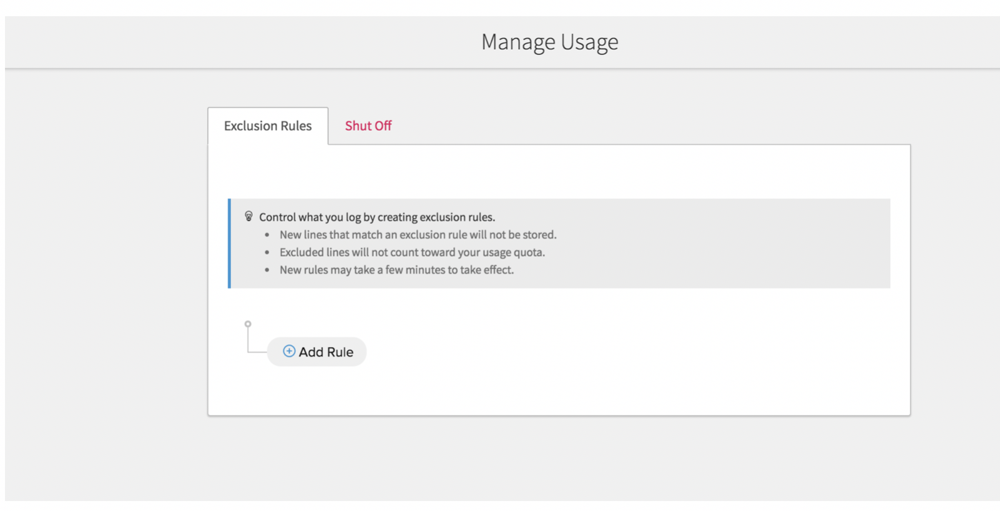
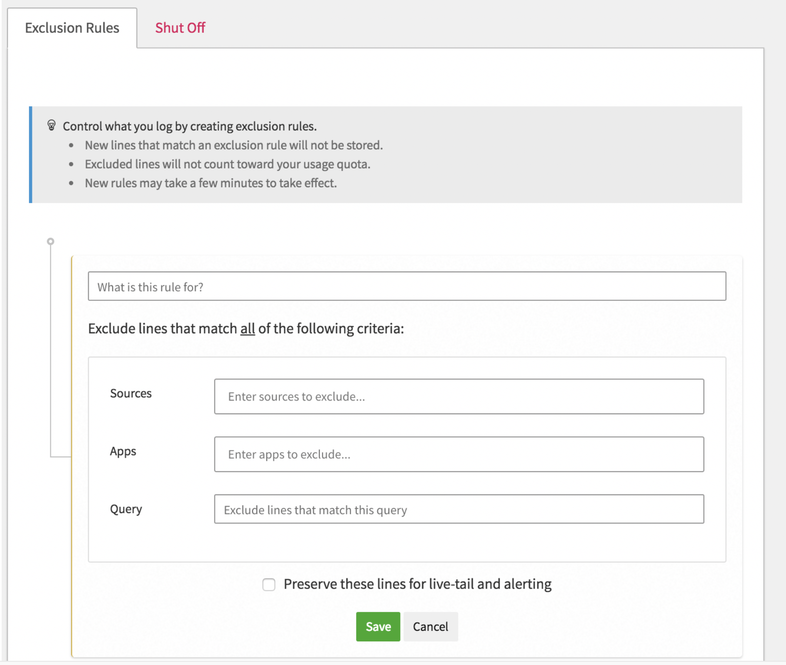
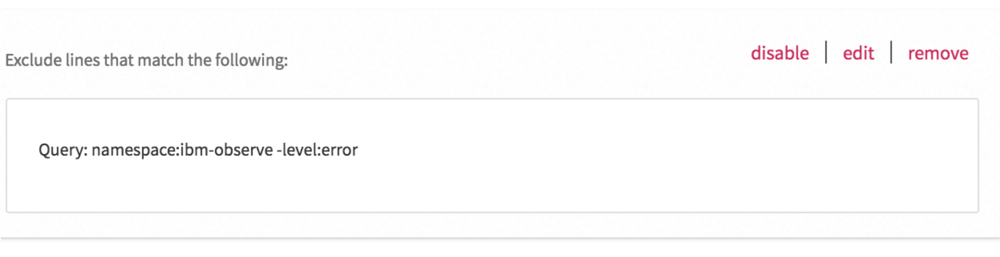

## Filter out logs from the UI from a namespace except error entries {#filter-out-logs-from-the-ui-from-a-namespace-except-error-entries}

Stop showing logs from a namespace, for example, ibm-observe namespace logs, except the ones that report an error:

In this step, you will learn how to exclude data from the namespace ibm-observe from the cluster while keeping entries that report errors only. You will configure the rule so that you are NOT able to see all log data through views and therefore not be able to define alerts on all the data.

Complete the following steps:

1. Select the settings icon .

2. Select **USAGE**.

    

    The _Manage Usage_ page opens.

    

3. In the **Exclusion Rules** section, select **Add rule**.

    

4. Enter the following query in the **Query** field:

    ```
    Namespace:ibm-observe -level:error
    ```

    
