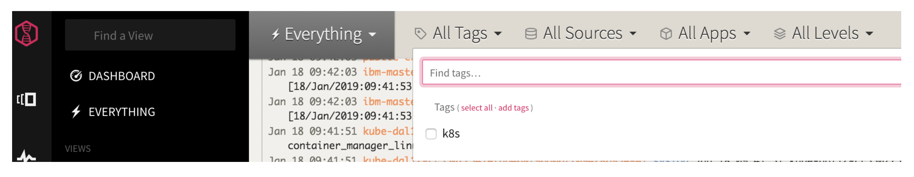
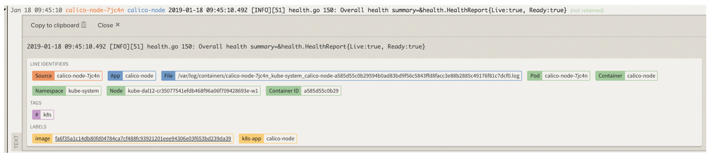

# Customize the LogDNA agent {#customize-the-logdna-agent}

There are different parameters that you can configure to customize the LogDNA agent:

| Parameter | Description |
| --- | --- |
| tags | Configure this parameter to define tags that group hosts automatically into dynamic groups |
| logdir | Configure this parameter to define custom paths that you want the agent to monitor. |
| exclude | Configure this parameter to define the files that you do not want the LogDNA agent to monitor. |
| exclude_regex | Configure this parameter to define regex patterns to filter out any lines that match the pattern. |
| hostname | Configure this parameter to define the hostname. |
| autoupdate | Set to 1 to update the agent automatically when the public repo agent definition is updated. |

In this lab, you will learn how to add custom tags to your Kubernetes cluster.

Tags are available in the _Views_ tab of the LOgDNA web UI. In the section **All Tags**, you will find additional tags that you configure by customizing the LogDNA agent.

Tags are also associated with a log record. If you look in detail to a log record in a view, you can see the **Tags** section where the default tags and custom tags will display:

