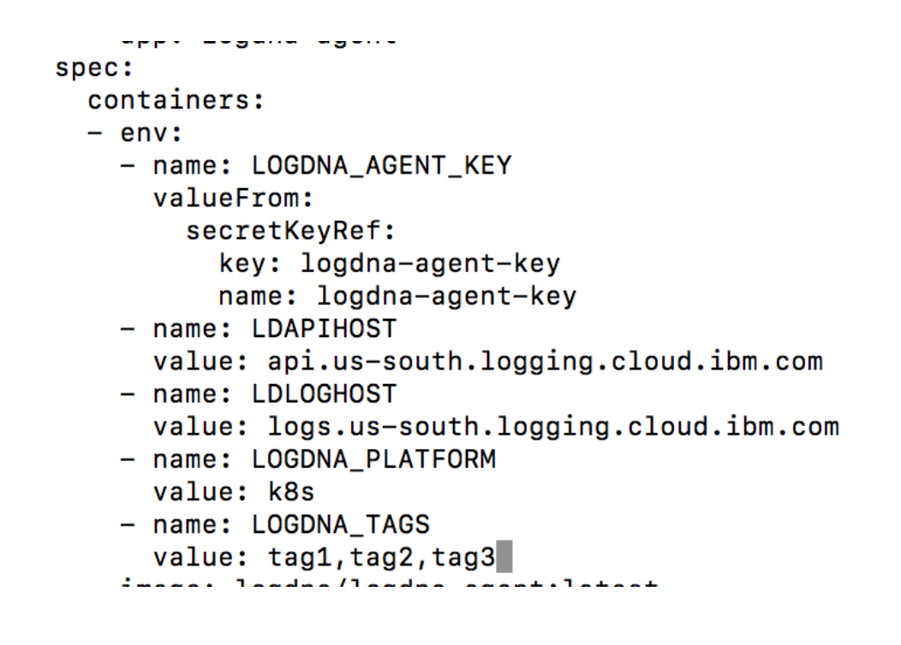
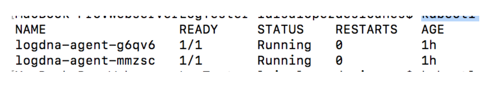
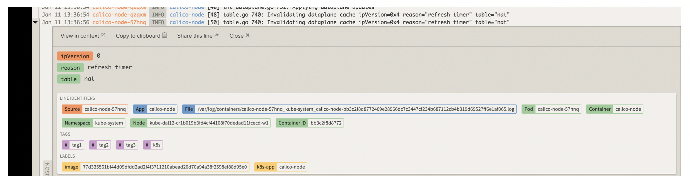

## Add custom tags to your Kubernetes cluster {#add-custom-tags-to-your-kubernetes-cluster}

Complete the following steps to add tags:

1. From the terminal where you set the cluster context in a previous step, generate the configuration file of the agent by running the following command:

    ```
    kubectl get daemonset logdna-agent -o=yaml &gt; prod-logdna-agent-ds.yaml
    ```

2. Make changes. Add the section LOGDNA_TAGS.

    ```
    - name: LOGDNA_TAGS
      value: tag1,tag2,tag3
    ```

    For example, the following section shows where to add tags in the configuration file:

    ```
    apiVersion: extensions/v1beta1
    kind: DaemonSet
    metadata:
      name: logdna-agent
    spec:
      template:
        metadata:
          labels:
            app: logdna-agent
        spec:
          containers:
          - name: logdna-agent
            image: logdna/logdna-agent:latest
            imagePullPolicy: Always
            env:
            - name: LOGDNA_AGENT_KEY
              valueFrom:
                secretKeyRef:
                  name: logdna-agent-key
                  key: logdna-agent-key
            - name: LDAPIHOST
              value: api.us-south.logging.cloud.ibm.com
            - name: LDLOGHOST
              value: logs.us-south.logging.cloud.ibm.com
            - name: LOGDNA_PLATFORM
            value: k8s
            - name: LOGDNA_TAGS
              value: tag1,tag2,tag3
    ```

    

3. Apply the configuration changes. Run the following command:

    ```
    kubectl apply -f prod-logdna-agent-ds.yaml
    ```

    **Note:** The logdna-agent has an OnDelete update strategy. After you update the DaemonSet, you must manually delete the DaemonSet pods so they are recreated and changes become active.

4. Get the logdna-agent pods. Run the following command:

    ```
    kubectl get pods
    ```

    

5. Delete all the logdna pods that are listed in the previous step.

    ```
    kubectl delete pod PodName
    ```

    For example:

    ```
    $ kubectl delete pod logdna-agent-g6qv6
    pod "logdna-agent-g6qv6" deleted
    ```

6. Verify the tags are attached to the cluster and also available for filtering in the LogDNA web UI.

    Go back to the LogDNA web UI.

    Get one of the latest records, and expand it. You should see the new tags attached to the log record.

    
    