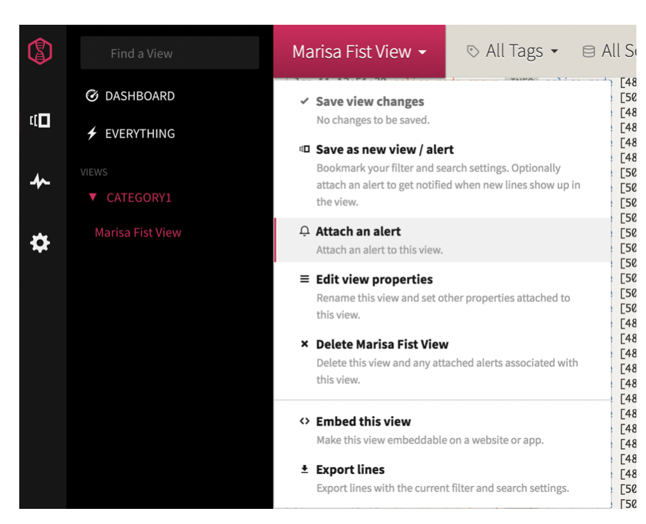
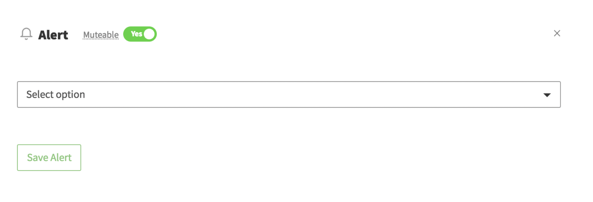
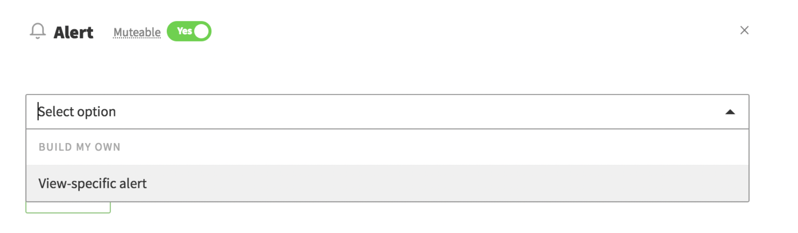
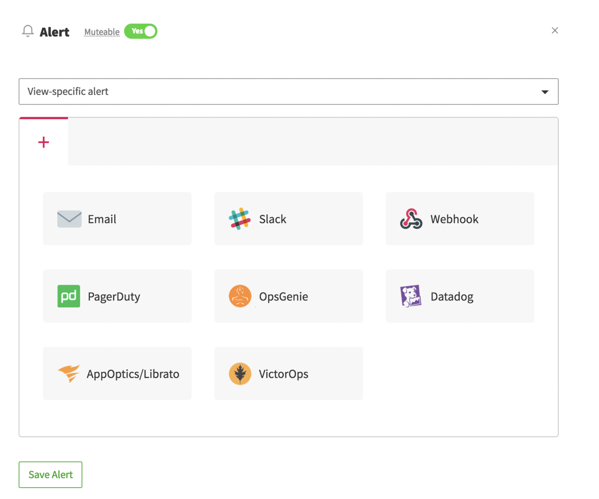
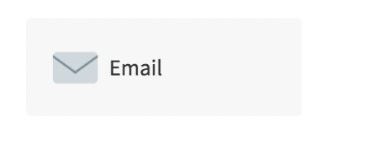
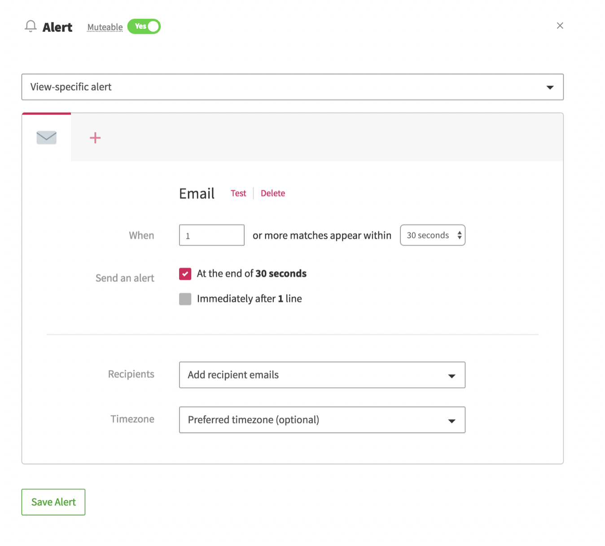
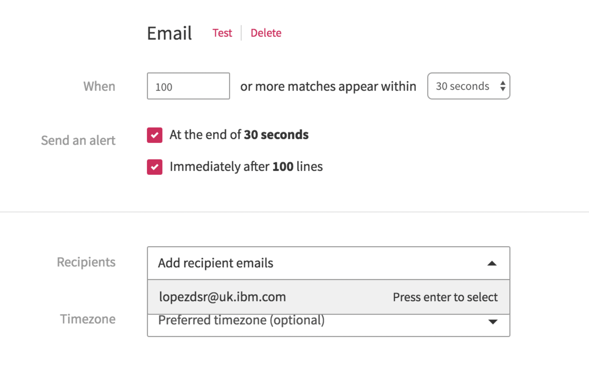
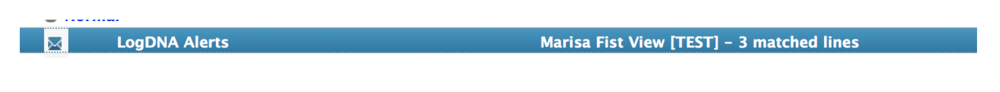
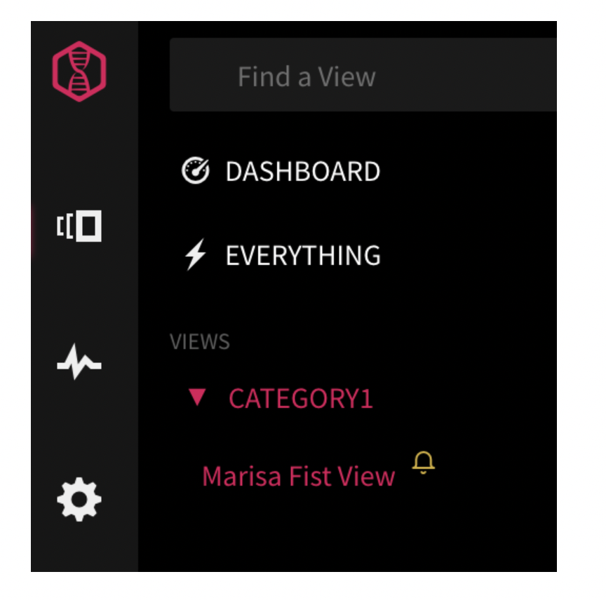

# [Optional] Configure an email alert {#configure-an-email-alert}

**NOTE: To complete this step you need a paid plan. Upgrade the service plan.**

You can attach one or more alerts to a view. You can define multiple notification channels for an alert. You can mute alerts. You can detach alerts from a view.

You can configure any of the following conditions for an alert:

* Time frequency: Specify how often to trigger an alert. Valid values are: 30 seconds, 1 minute, 5 minutes, 15 minutes, 30 minutes, 1 hour, 6 hours, 12 hours, 24 hours
* Log lines counter: Specify the number of log lines that match the view&#039;s filtering and search criteria. When the number of log lines is reached, an alert is triggered.

You can decide whether both conditions are checked or only one. If both conditions are set, an alert is triggered when any of the thresholds is reached.

For example, you can configure an alert that is triggered after 30 seconds, or when a 100 log lines that match the view&#039;s filtering and search criteria are collected.

You can configure multiple notification channels. Valid channels are: email, Slack, PagerDuty, Webhook, OpsGenie, Datadog, AppOptics, VictorOps

You can also define a preset. A preset is an alert template that you can attach to any number of views.

**Note:** To reuse an alert configuration with different views, configure an alert preset.

Notice that when you attach an alert to a view, a bell icon is displayed with the view to indicate that this view has an alert attached to it.

Complete the following steps to configure an alert:

1. From the Views section, select the view you created in the precious step.

2. Select **Attach an alert**.

    

    The alert wizard page opens.

    

3. Click **Select an option**.

    

4. Click **View-specific alert**.

    

5. Select **email**.

    

6. Configure the notification channel details.

    

    Change the rule to say: **When 100 or more matches appear within 30 seconds**

    Select **Add recipient emails**. Enter your email.

    

7. Click **Test.** You will receive an email with information about the alert.

    

8. Click **Save Alert**.

    Notice the bell icon by the view to indicate that it has alert defined.

    
