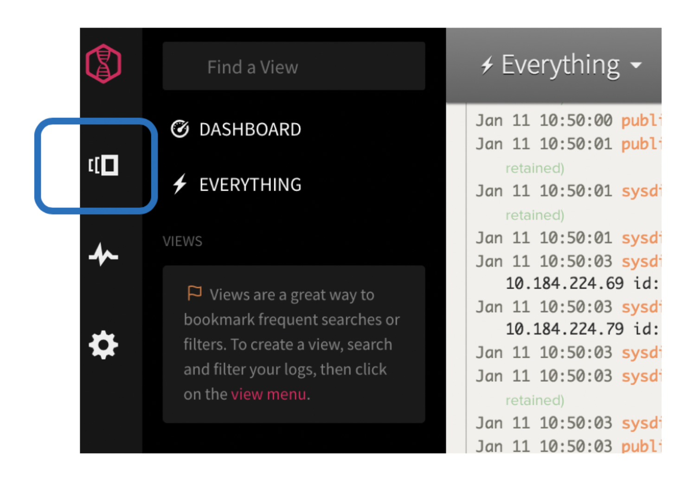

## Create a view by filtering data through tags {#create-a-view-by-filtering-data-through-tags}

Complete the following steps to create a view:

1. Click the **Views** icon.

    

2. Select **Everything.**

3. Select **All Apps** to list the log level values that you can choose from to include or exclude entries.

    

4. Select **calico-node** to filter in log entries from the calico-node app.

    

5. Click **All Apps** again to close the selection panel.

    Notice that section **Unsaved View**.

    

6. Click **Unsaved View**.

    

7. Select **Save as new view /alert**.

    The _Create new view_ page opens.

    

8. Enter a name. For example: Marisa First View

9. Add a **Category**.

    Enter a category name in the **Uncategorized** field. For example: Category1

    
    
    Click **Add this as a new view category**.

    

10. Click **Save View**.

    Notice how the UI changes to reflect this new view and category.

    

