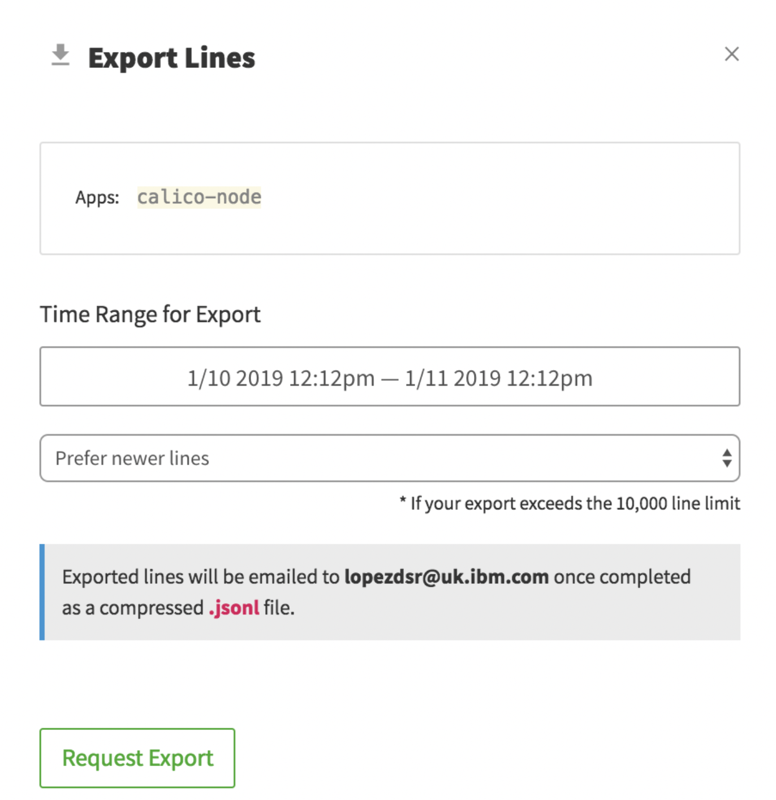

## Export logs to a local file {#export-logs-to-a-local-file}

**NOTE: To complete this step you need a paid plan. Upgrade the service plan.**

You can export log data in JSONL format from an IBM Log Analysis with LogDNA instance into a local file.

You can export logs programmatically or from the IBM Log Analysis Web UI.

Consider the following information when you export log data:

*   You export a set of log entries. To define the set of data that you want to export, you can apply filters and searches, and specify the time range.
*   From the Web UI, when you export logs, you get an email, that is sent to your email address, with a link to a compressed file that includes the data. To get the data, you must click the link and download the compressed file.
*   When you export logs programmatically, you can choose to send an email or to stream logs in to your terminal.
*   The compressed log file containing the data that you want to export is available for a maximum of 48 hours.
*   The maximum number of lines that you can export is 10,000.

In this lab, you will learn how to export data from the LogDNA web UI. To learn how to export logs by using the API, see https://cloud.ibm.com/docs/services/Log-Analysis-with-LogDNA/export.html#api

Complete the following steps to export log data:

1. From the Views section, select the view you created in the precious step.

    

2. Click **Export lines**.

    

3. Select **Prefer newer lines** to show the latest log lines in case the export request exceeds the line limit.

4. Click **Request** Export. You will receive an email from **LogDNA** with a link to download your exported lines.

5. Check your email for an entry like the following:

    

6. Click on the link attached to the email to download the log lines.