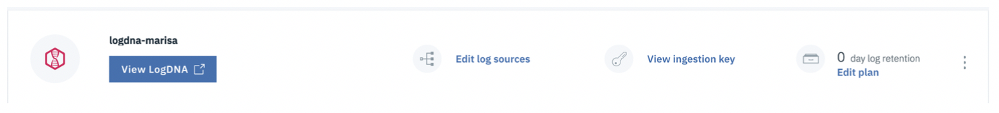
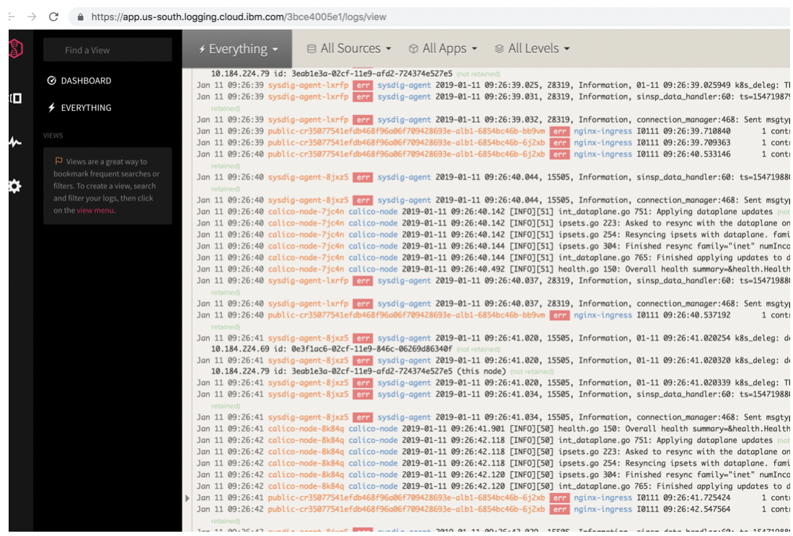

# Navigate to the LogDNA web UI {#navigate-to-the-logdna-web-ui}

You launch the LogDNA web UI within the context of an IBM Log Analysis with LogDNA instance, from the IBM Cloud Observability dashboard.

Complete the following steps to launch the web UI:

1.  Log in to your IBM Cloud account.

    The IBM Cloud dashboard can be found at: [http://cloud.ibm.com ](http://cloud.ibm.com/)

    After you log in with your user ID and password, the IBM Cloud Dashboard opens.

2.  In the navigation menu, select **Observability**.

3.  Select **Logging**.

    The list of instances that are available on IBM Cloud is displayed.

4.  Select one instance. Then, click **View LogDNA**.

    
    
The **LogDNA web UI** opens.

