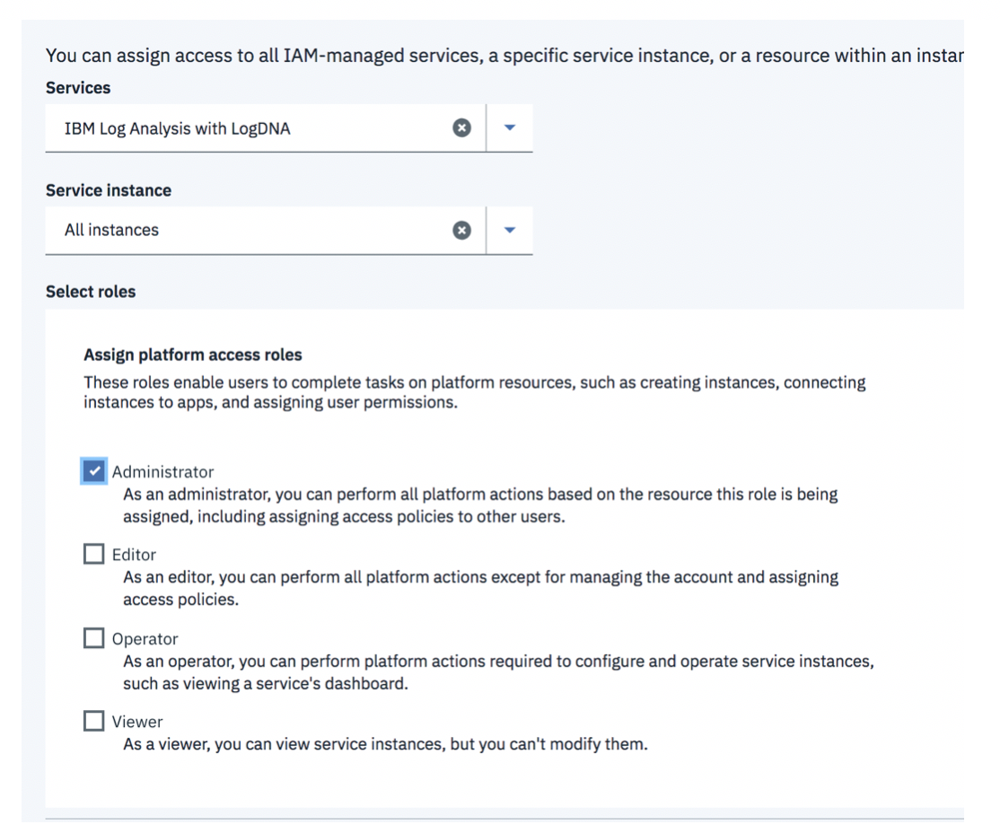
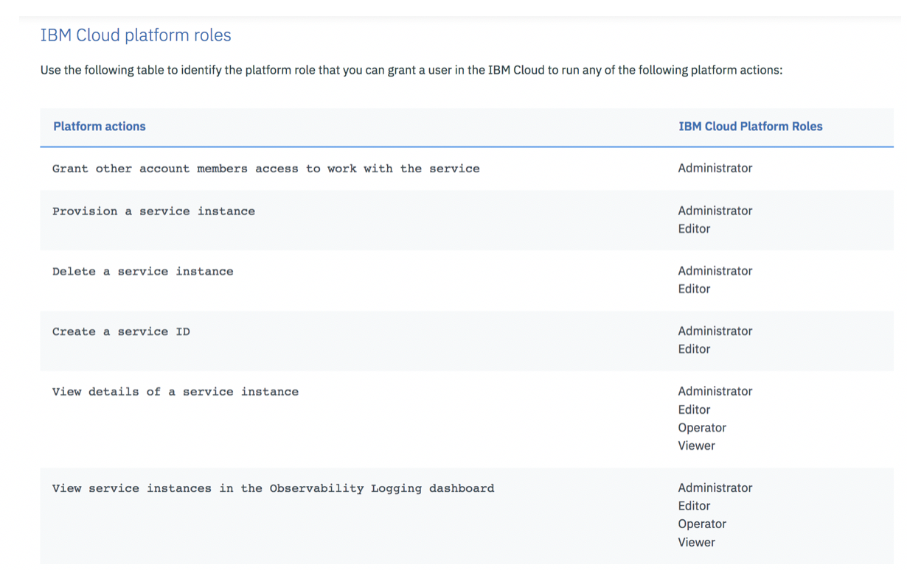

# Provision an instance of IBM Log Analysis with LogDNA {#provision-an-instance-of-ibm-log-analysis-with-logdna}

Before you can monitor and manage logs with LogDNA, you must provision an instance of the IBM Log Analysis with LogDNA service in the IBM Cloud.

You can provision an instance of IBM Log Analysis with LogDNA in any of the following ways:

1.  From the Observability section in the IBM Cloud UI
2.  [From the Catalog](https://cloud.ibm.com/docs/services/Log-Analysis-with-LogDNA/provision.html)
3.  [From the command line](https://cloud.ibm.com/docs/services/Log-Analysis-with-LogDNA/provision.html)

You provision an instance within a resource group.

**Note**: Once you provision an instance in a resource group, you cannot change it.

To provision an instance, your user ID needs 2 different permissions:

1.  Permission within a resource group. 

    This is the resource group where you are going to provision the logging service.

2.  Permission to work with the IBM Log Analysis with LogDNA service. 

    Your IBM ID must have a policy for the service with platform permissions in the IBM Cloud that allow you to provision it in a resource group and manage it. 
    
    For example, you must have a policy for the service IBM Log Analysis with LogDNA with one of the following platform roles: administrator, editor

The following table shows the IBM Cloud platform roles that are required to perform the actions outlined:

