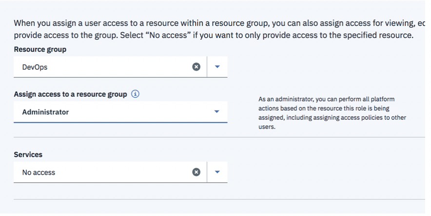
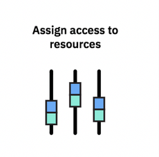
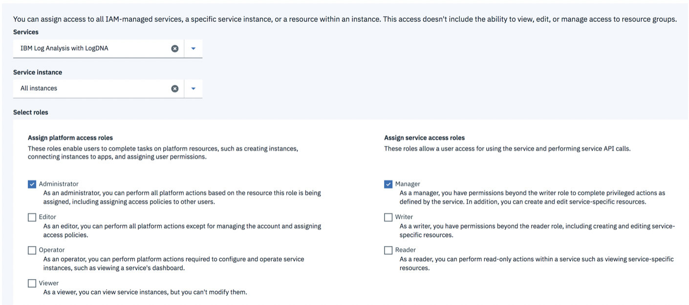

# Step 1: Grant permissions to your user ID in the IBM Cloud{#step-1-grant-permissions-in-the-ibm-cloud}

**Note:** This step must be completed by the account owner or an administrator of the IBM Log Analysis with LogDNA service on the IBM Cloud in your account.

To provision and manage the IBM Log Analysis with LogDNA service, your user ID must have permissions in the IBM Cloud .

Complete the following steps to assign a user administrator role to the IBM Log Analysis with LogDNA service within the context of a resource group:

## 1. Create the access group **logdna-admins**{#1}

1. From the menu bar, click **Manage** &gt; **Access (IAM)**.

2. Create an access group: logdna-admins

    a. Select **Access Groups**.

    b. Click **Create**.

    c. Enter the name of the access group: **logdna-admins**

    d. [Optional] Enter a description.

### 2. Add an access policy for the resource group where you are going to provision the IBM Log Analysis with LogDNA service{#2}

From the access group dashboard, complete the following steps:

1. Click **Access Policies**.

2. Click **Assign Access**.

3. Select **Assign Access within a Resource Group**.

    

4. Select the name of the resource group. Choose **Default**.

    Note: You can use any other resource group where you have permissions in the account.

5. Select the role. Choose **Administrator**.

6. Click **Assign**.

For example, if you have a resource group *DevOps*, the policy should be configured as shown in the picture:

### 3. Add an access policy to work with the IBM Log Analysis with LogDNA service{#3}

From the access group dashboard, complete the following steps:

1. Click **Access Policies**.

2. Click **Assign Access**.

3. Select **Assign Access to resources**.

    

4. Select **IBM Log Analysis with LogDNA**.

5. Select **All instances**.

6. Select **administrator** role for the platform role.

7. Select **manager** role for the service role.

8. Click **Assign**.

## 4. Grant your user ID permissions{#4}

1. Click **Add users**.

2. Choose your IBM ID.

3. Click **Add to group**.
