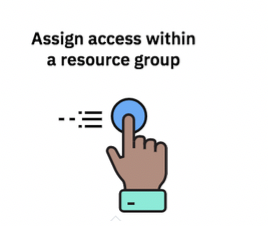

## Step 1: Grant permissions in the IBM Cloud {#step-1-grant-permissions-in-the-ibm-cloud}

**Note:** This step must be completed by the account owner or an administrator of the IBM Log Analysis with LogDNA service on the IBM Cloud in your account.

Complete the following steps to assign a user administrator role to the IBM Log Analysis with LogDNA service within the context of a resource group:

1.  Create an access group **logdna-admins**.
    a.  From the menu bar, click **Manage** &gt; **Access (IAM)**.
    b.  Create an access group: logdna-admins
        1.  Select **Access Groups**.
        2.  Click **Create**.
        3.  Enter the name of the access group: **logdna-admins**
        4.  [Optional] Enter a description.
2.  Add an access policy for theresource group where you are going to provision the IBM Log Analysis with LogDNA service. In the lab, you can use DevOps or use default, if you prefer.
    1.  Click **Access Policies**.
    2.  Click **Assign Access**.
    3.  Select **Assign Access within a Resource Group**.

        

    4.  Select the name of the resource group. Choose DevOps.
    5.  Select the role. Choose Administrator.
    6.  Click **Assign**.

        

3.  Add an access policy to work with the IBM Log Analysis with LogDNA service.
    1.  Click **Access Policies**.
    2.  Click **Assign Access**.
    3.  Select **Assign Access to resources**.

        

    4.  Select **IBM Log Analysis with LogDNA**.
    5.  Select **All instances**.
    6.  Select administrator role for the platform role.
    7.  Select **manager** role for the service role.

        

    8.  Click **Assign**.
4.  Select **Users**.
    1.  Click **Add users**.
    2.  Choose your IBM ID.
    3.  Click **Add to group**.