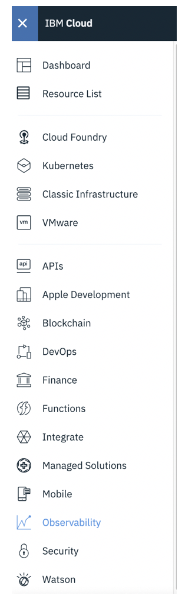
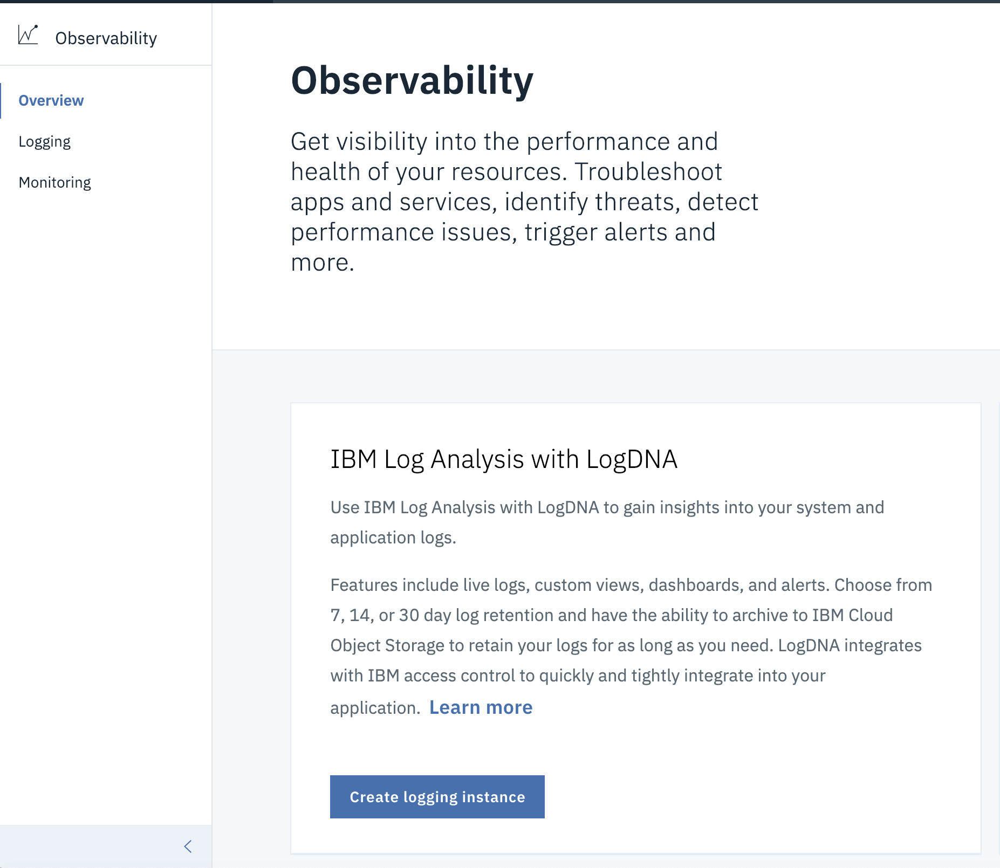
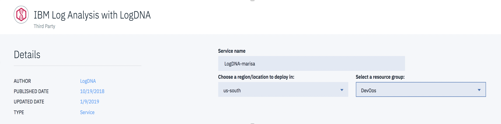
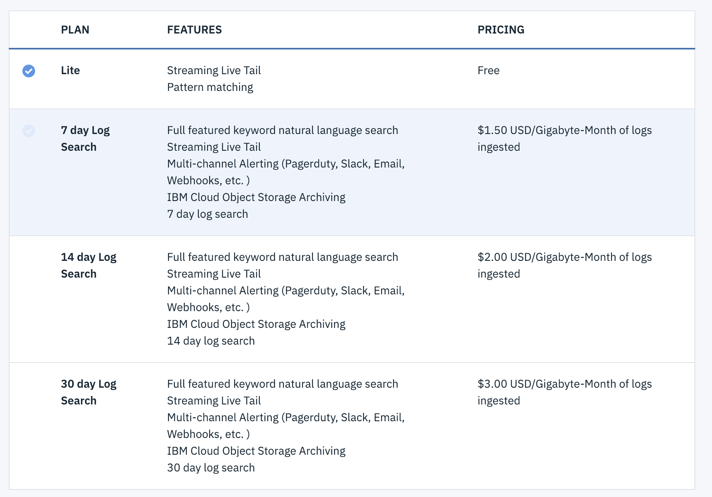

## Step 2: Provisioning an instance from the Observability dashboard {#step-2-provisioning-an-instance-from-the-observability-dashboard}

To provision an instance of IBM Log Analysis with LogDNA by using the IBM Cloud UI, complete the following steps:

### 1.  Log in to your IBM Cloud account{#1}

Log in to your IBM Cloud account

The IBM Cloud dashboard can be found at: [https://cloud.ibm.com](https://cloud.ibm.com)

After you log in with your user ID and password, the IBM Cloud UI opens.

### 2. Launch the Observability page{#2}

1. Click the Navigation Menu.

    

2. Select Observability.

    

### 3. Create a logging instance{#3}

1. From the Observability page, click **Create logging instance**.

    

2. Enter a name for the service instance. For example, _logdna-marisa_

    

3. Select the **DevOps** resource group.

    By default, the **Default** resource group is set.

    **Note:** If you are not able to select a resource group, check that you have editing permissions on the resource group where you want to provision the instance.

4. Select the **Lite** service plan. 

    By default, the **Lite** plan is set.

    

8.  Click **Create**.

After you provision an instance, the _Observability_ dashboard opens.

Next, configure a LogDNA agent. This agent is responsible for collecting and forwarding logs to LogDNA.