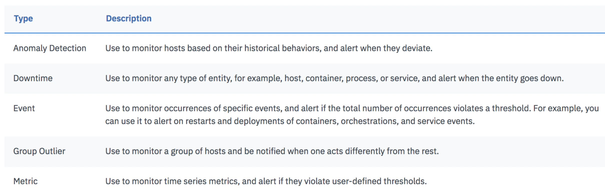

# Alert to notify on error conditions {#alert-to-notify-on-error-conditions}

Alerting provides notifications to different teams and members when an application is not behaving as it should or the application is running low in resources to meet requests timely. For example:

*   Alert me when my application response time is slower than 200ms.
*   Alert someone when a microservice is triggering errors.
*   Alert the database team when the database service is down.
*   Alert the cluster ops team when the number of running pods is less than the desired number of instances.
*   Alert the application team when CPU quota is below 20% (so that you can optimize resources).
*   Alert the cluster ops when the disk usage is above 80%.
*   Alert the cluster ops when the inodes usage is above 80%.

An alert is a notification event that you can use to warn about situations that require attention. Each alert has a severity status. This status informs you about the criticality of the information it reports on.

When you define an alert, you must define the condition that triggers the notification, one or more notification channels through which you want to be notified, the severity of the alert, and the type of alert.

You can define alerts for any of the following alert types:

By default, severity is set to _warning_. You can set the severity of an alert to any of the following values: _emergency_, _alert_, _critical_, _error_, _warning_, _notice_, _informational_, debug

You can define one or more notification channels for any of the following notification integrations:

*   Email Notifications
*   PagerDuty Notifications
*   Slack Notifications
*   VictorOps Notifications
*   OpsGenie Notifications
*   Configure a Webhook Channel

You can enable predefined alerts, modify alerts, and create custom alerts in the web UI and by using the Sysdig API.

In this lab, you will learn how to define the alert**: [APM] Ticket generator HTTP errors**

*   This alert is triggered when an error condition is detected.
*   This alert detects any HTTP errors (net.http.statusCode = 5xx or 4xx) in the ticket-generator namespace.