## Step 1: Define the alert {#step-1-define-the-alert}

### 1. Add an alert{#1}

In the *Alerts* tab, select **Add Alert**.

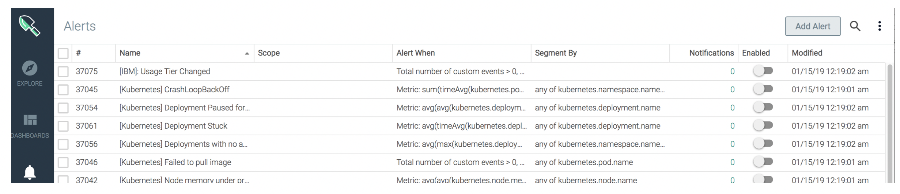

Select the Alert Type **Metric**.

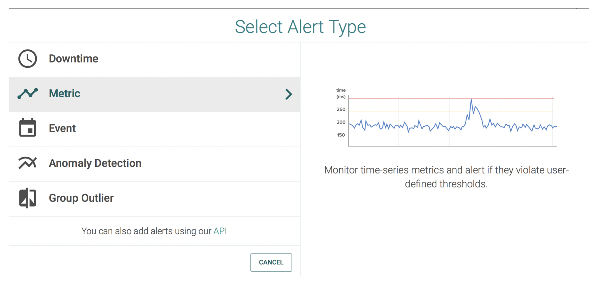

The _New Metric Alert_ page opens.

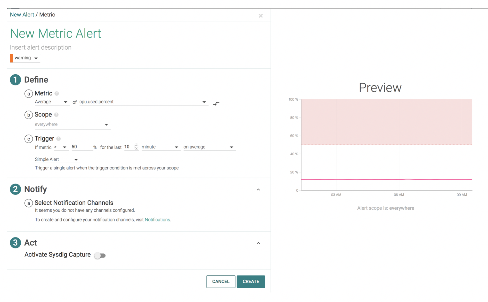

Enter the following name for the metric: **[APM] Ticket generator HTTP errors**

1. Click **New Metric Alert**

2. Enter the name of the alert

Choose the severity of the alert:

1. Click **warning**.

2. Select **error**.

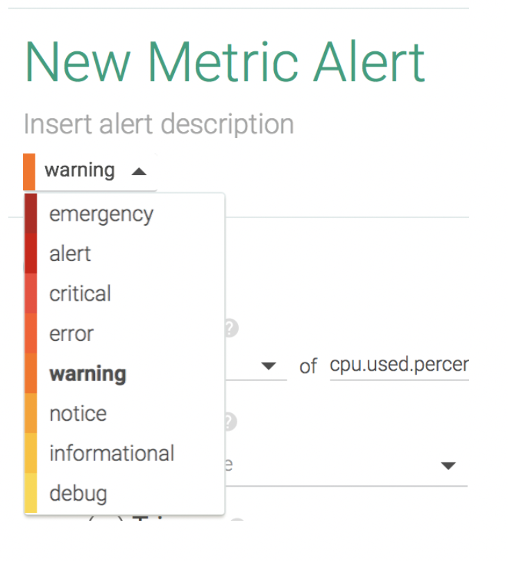

### 2. Define metric details{#2}

Select how to group the data for the metric on which you want to define the alert. Choose **Average**.

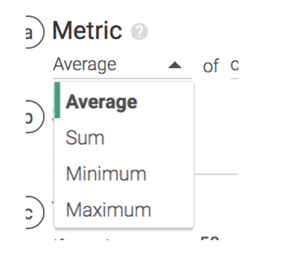

Choose the metric **net.http.request.count** for which you want to define the alert.

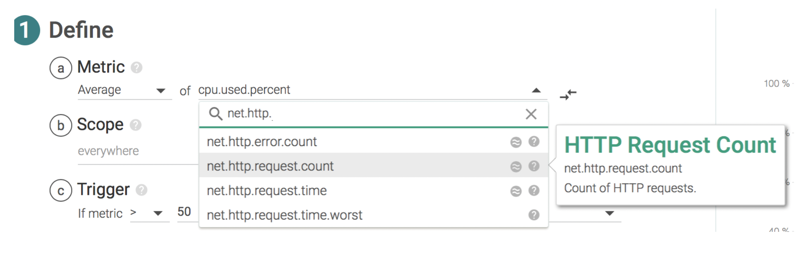

### 3. Set the scope{#3}

**Filter the scope of the data to be monitored to the namespace where the application is running.**

Select **kubernetes.namespace.name**.

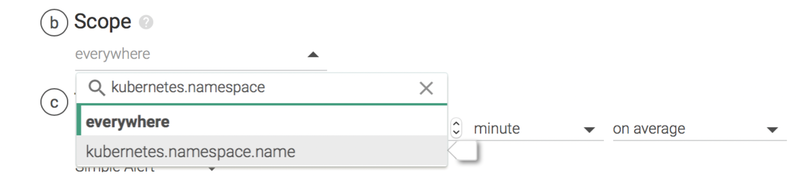

Select the operand **is**.

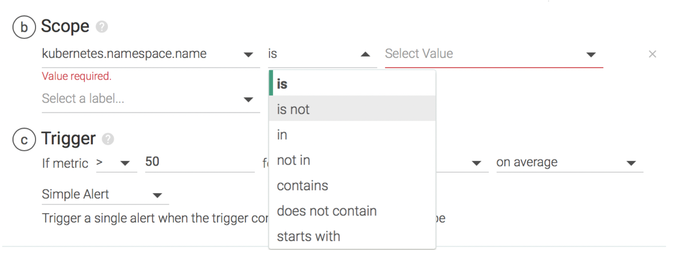

Select the value **ticket-generator**.

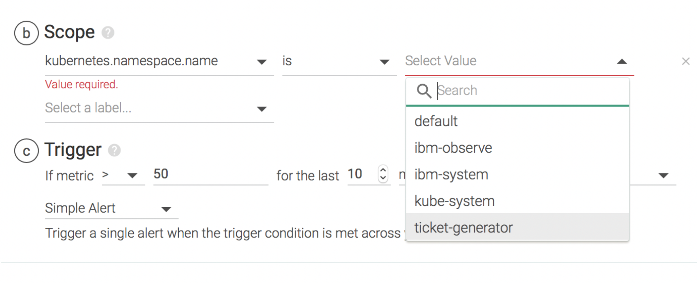

**Add a second rule to limit the scope so the alert is triggered when specific status codes are identified.**

Select the label **net.http.statusCode**.

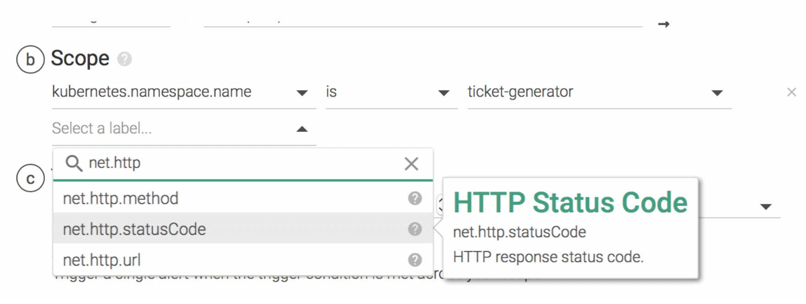

And the values that you want to alert on: **500, 400, 404**

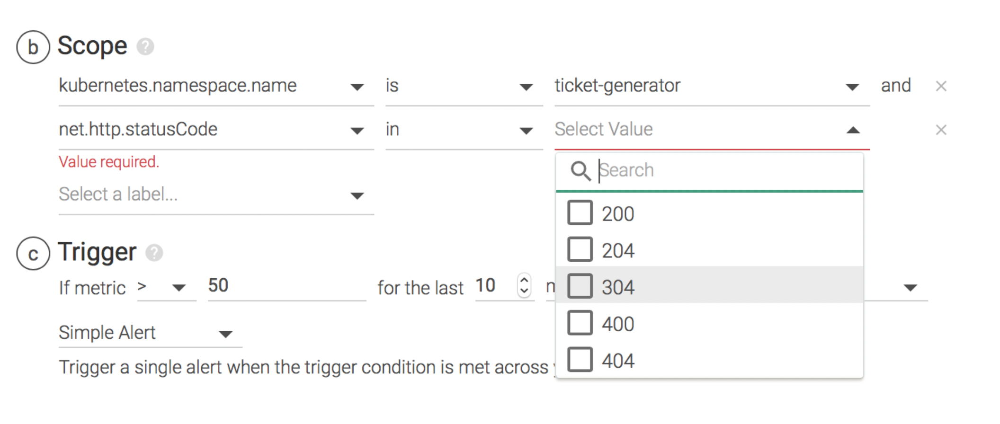

**NOTE**: When you look for the first time for code 500, you cannot see it. However, type it in the search bar and select it. It will show in the list.

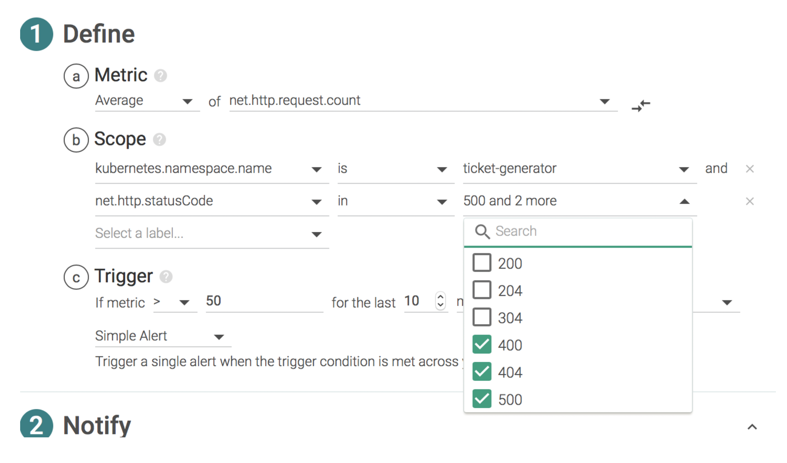

### 4. Set the trigger condition{#4}

Set the trigger condition as shown in the image:

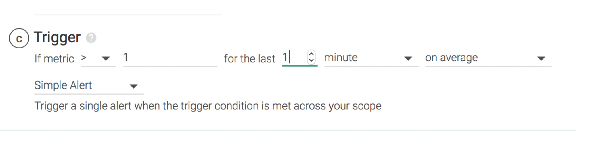

The definition section should look like:

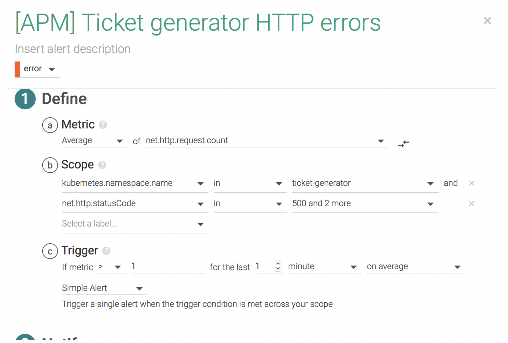

Click **Save**.

You can see the alert defined in the _Alerts_ dashboard.

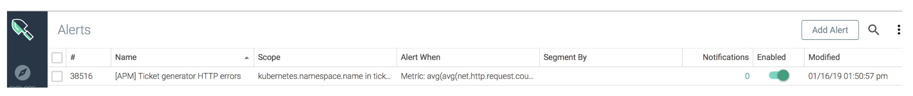