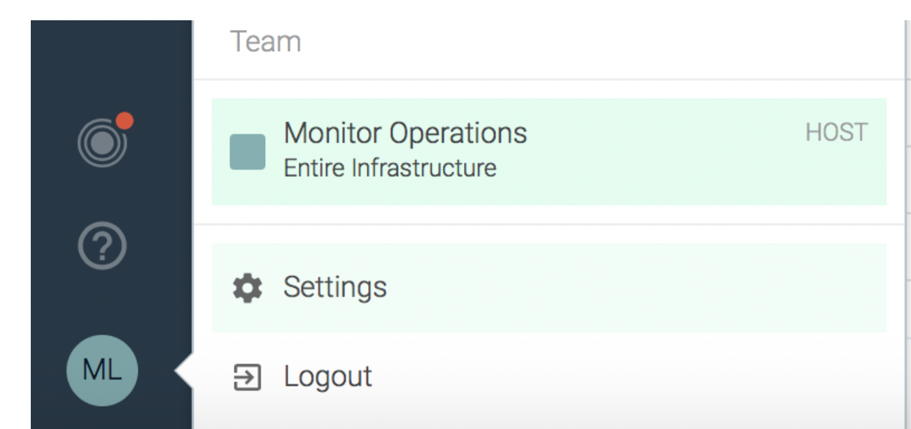
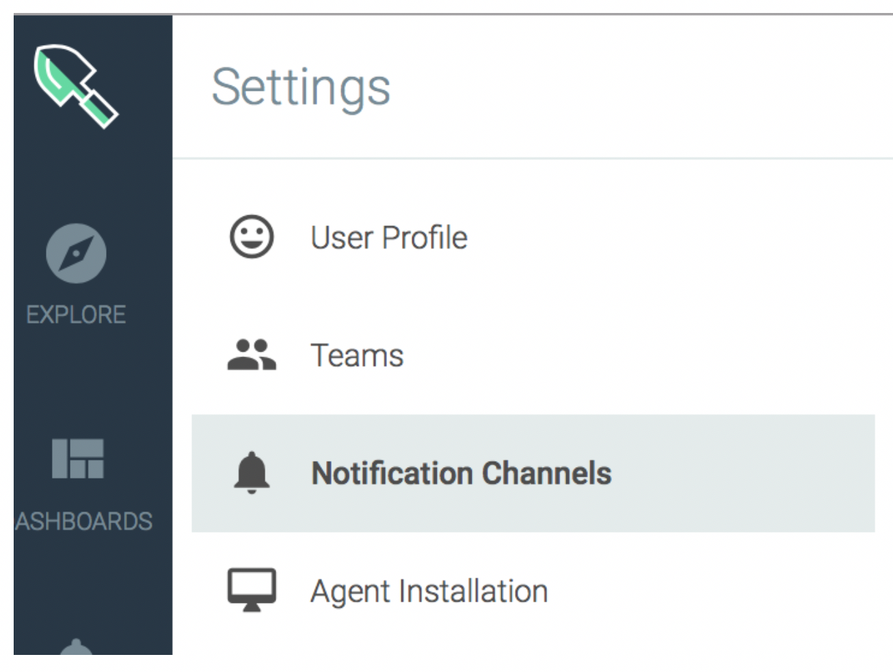
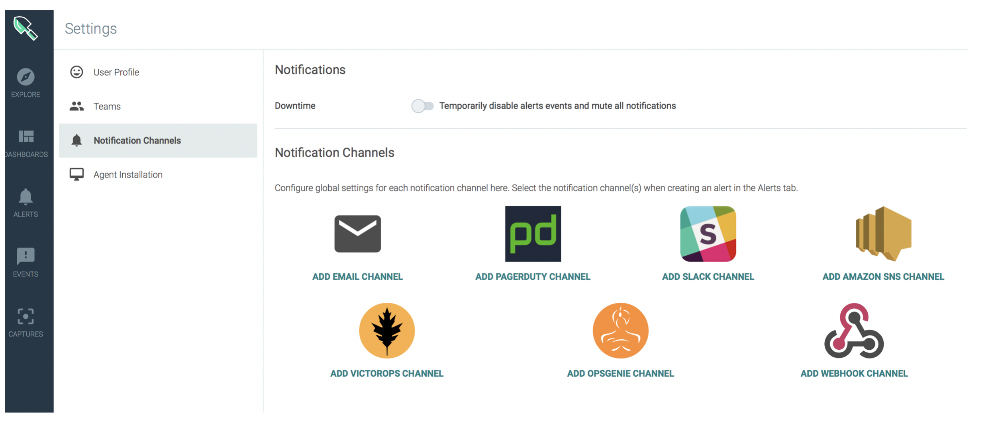
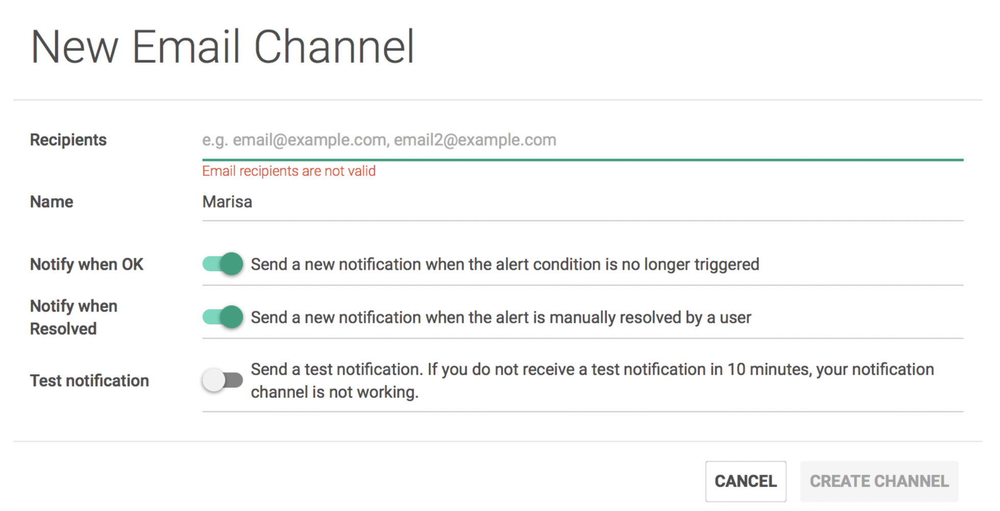
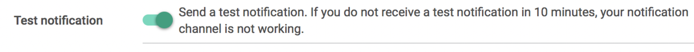

## Step 2: Define the notification channel {#step-2-define-the-notification-channel}

Select **Settings**.

Select **Notification Channels**.

The Notifications tab opens in a new browser page.

Select **Add email channel**.

The _New Email Channel_ page opens.

Enter your email address in the Recipients field.

Enter the name of the channel. For example, name it after you.

Test the notification. Enable the **test notification** option.

Click **Create Channel**.