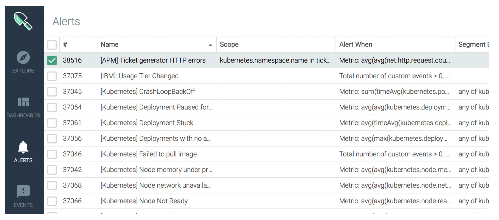
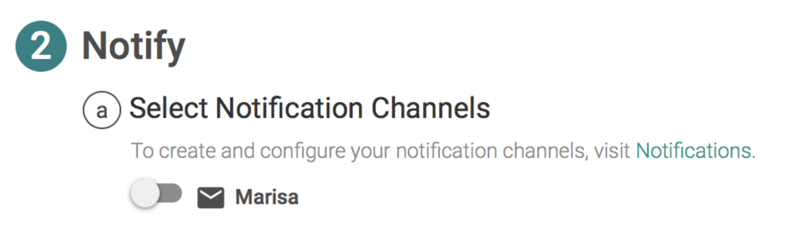
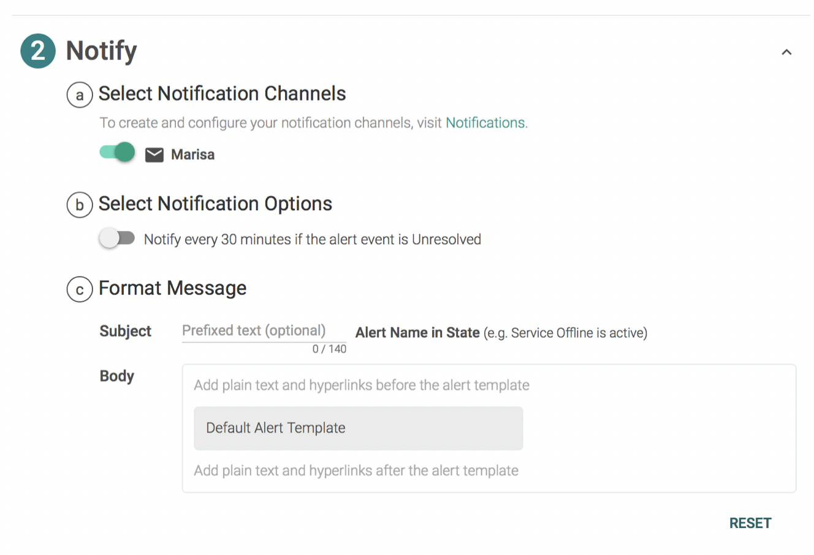

# Step 3: Add the notification channel to the alert {#step-3-add-the-notification-channel-to-the-alert}

Edit the alert definition.

In the _Alerts_ tab, double click the alert **[APM] Ticket generator HTTP errors**.

Click **Notify**.

Select a notification channel.

Click **Save**.
