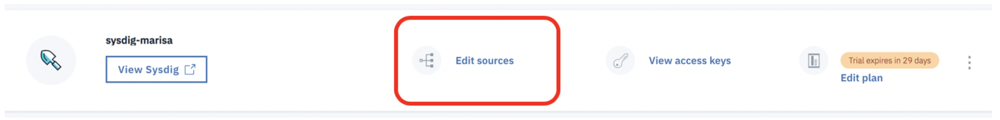

# Configure a Sysdig agent to monitor a Kubernetes cluster {#configure-a-sysdig-agent-to-monitor-a-kubernetes-cluster}

Open a terminal in your local environment and complete the following steps to configure a Sysdig agent on a Kubernetes cluster that runs in the IBM Cloud Kubernetes Service:

### 1. Log in to IBM Cloud{#1}

Log in to IBM Cloud. Run the following command:

```
ibmcloud login -a api.ng.bluemix.net
```

**Note**: If you have a federated ID, use `ibmcloud login --sso` to log in to the IBM Cloud.

### 2. Set up the cluster environment{#2}

1. List the clusters. Run the following command:

    ```
    ibmcloud ks clusters
    ```

2. Set the resource group where the cluster is available. Run the following command:

    ```
    ibmcloud target -g ResourceGroupName
    ```

    You can run the command `ibmcloud ks cluster-get ClusterName` to find out the resource group.

3. Set the region where the cluster is available. Although you have logged in to the us-south region, you must set the region as part of setting the command line to work with the IBM Cloud Kubernetes service.

    ```
    ibmcloud ks region-set us-south
    ```

4. Get the command to set the environment variable and download the Kubernetes configuration files. 

    ```
    ibmcloud ks cluster-config CLUSTERNAME
    ```
    When the download of the configuration file is finished, a command is displayed.  

5. Copy and paste that command in your terminal to set the KUBECONFIG environment variable.


**Note:** Every time you log in to the IBM Cloud Kubernetes Service CLI to work with clusters, you must run these commands to set the path to the cluster&#039;s configuration file as a session variable. The Kubernetes CLI uses this variable to find a local configuration file and certificates that are necessary to connect with the cluster in IBM Cloud. 


### 3. Deploy the Sysdig agent{#3}

In this step, you will deploy the sysdig agent by running a script.

From the _Observability_ dashboard, select **Edit sources**.



Copy the command from the section **Install Sysdig Agent to your cluster**. 

Before you run it, add the following tags: workshop:lab,location:SanFrancisco

The command looks as follows:

```
curl -sL https://raw.githubusercontent.com/draios/sysdig-cloud-scripts/master/agent_deploy/IBMCloud-Kubernetes-Service/install-agent-k8s.sh | bash -s -- -a xxxxxxxx-xxxx-xxxx-xxxx-xxxx -c ingest.us-south.monitoring.cloud.ibm.com -t workshop:lab,location:San_Francisco -ac 'sysdig_capture_enabled: false'
```

Notice that the command already includes the correct values for the access key and the ingestion URL.

*Information about the command:*

```
curl -sL https://raw.githubusercontent.com/draios/sysdig-cloud-scripts/master/agent_deploy/IBMCloud-Kubernetes-Service/install-agent-k8s.sh | bash -s -- -a SYSDIG_ACCESS_KEY -c COLLECTOR_ENDPOINT -t TAG_DATA -ac 'sysdig_capture_enabled: false'
```

where:

*   SYSDIG_ACCESS_KEY is the ingestion key for the monitoring instance.
*   COLLECTOR_ENDPOINT is the ingestion URL ( **ingest.us-south.monitoring.cloud.ibm.com**).
*   TAG_DATA are comma-separated tags that are formatted as _TAG_NAME:TAG_VALUE_. You can associate one or more tags to your Sysdig agent.

To disable the Sysdig capture feature, you must set **sysdig_capture_enabled** to _false_. By default, this value is set to _true_.


### 4. Verify that the Sysdig agent is running{#4}

Verify that the Sysdig agent is running. Cluster resources are located in the **ibm-observe** namespace.

Check that the pods are running. Your cluster has two workers running, therefore, you should see two sysdig-agent pods.
    
Run the following command:

```
kubectl --namespace=ibm-observe get pods
```

To check that the secret containing the access key has been created, you can run the following command:

```
kubectl --namespace=ibm-observe get secrets
```
