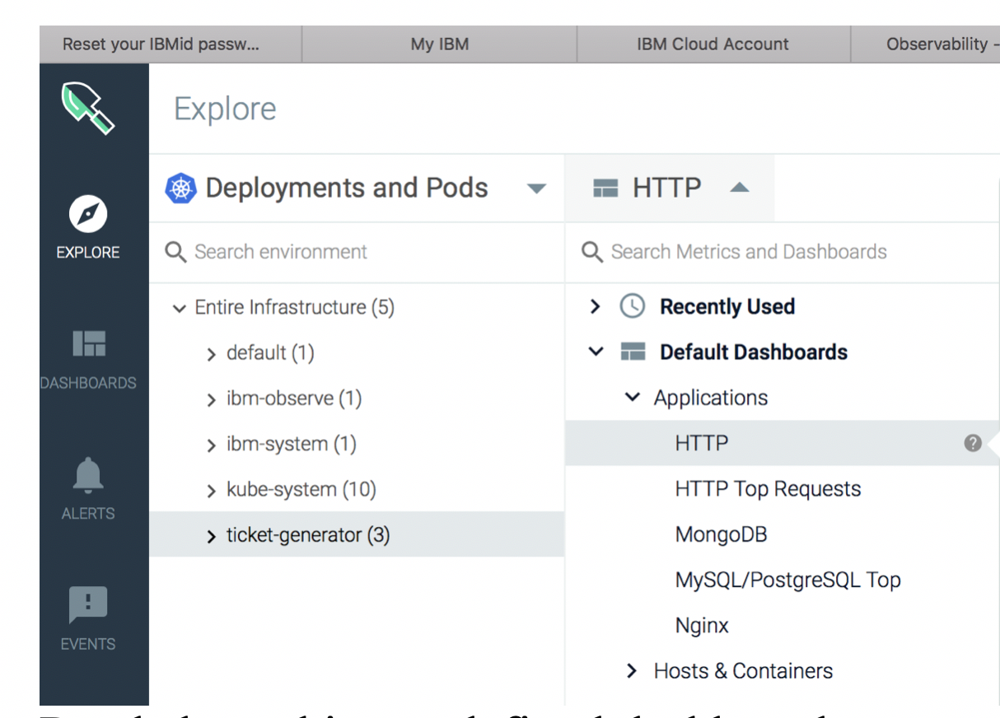
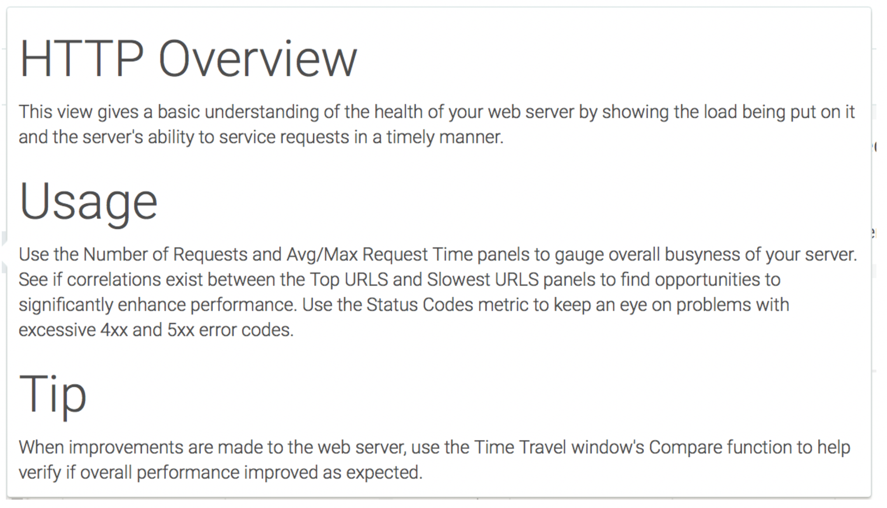
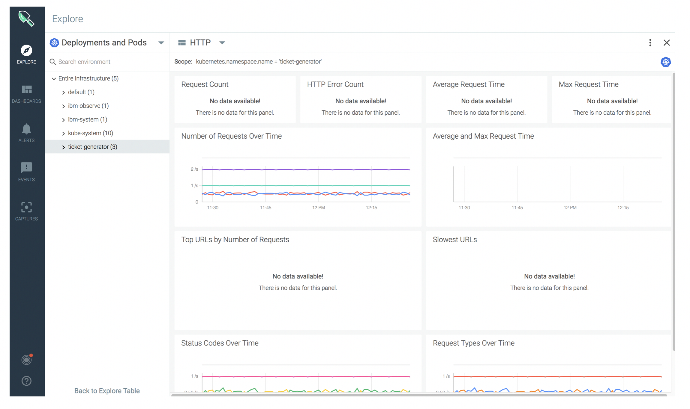
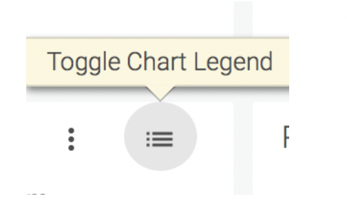
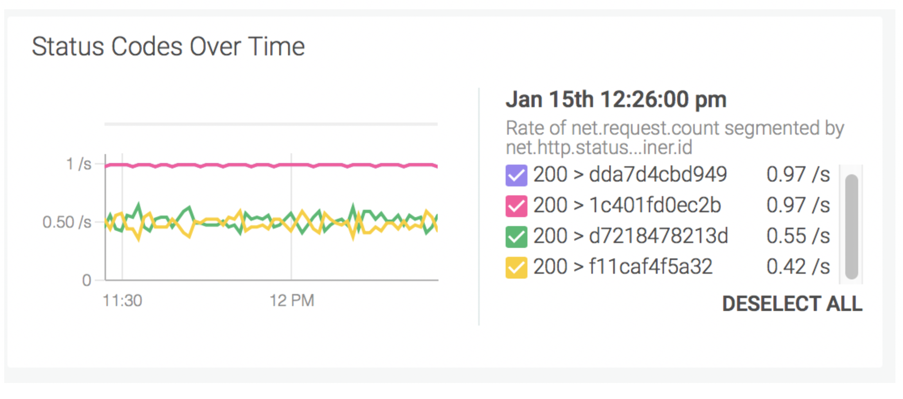

## Check for HTTP response codes {#check-for-http-response-codes}

Look at the **HTTP Dashboard**.

1. From the _Explore_ tab, select **Deployments and Pods.**

2. Select the namespace **ticket-generator.**

3. Click .

4. Select **Default Dashboards** &gt; **Applications**.

5. Select **HTTP**.

Read about this pre-defined dashboard:

Look at the different panels that are configured in the dashboard:

Check the **Status Codes Over Time** panel.

Click the icon to toggle the chart and display the response codes by the graph:

Look for 4xx and 5xx errors.

