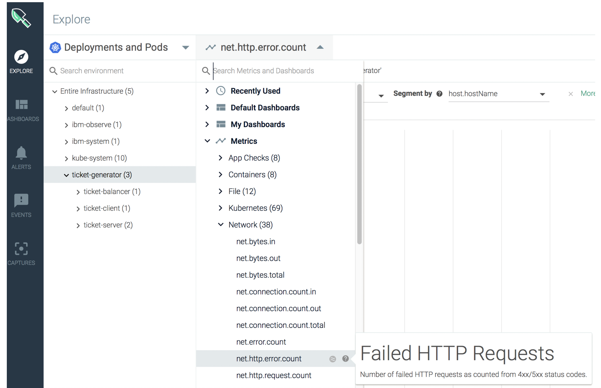
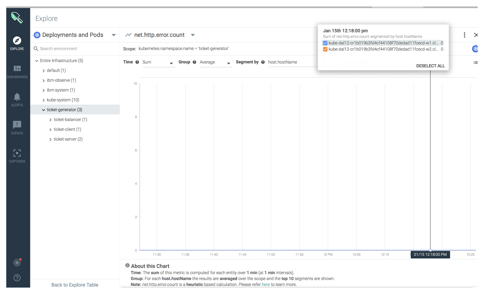
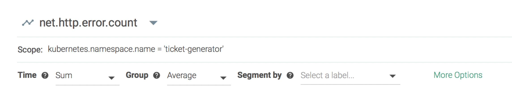
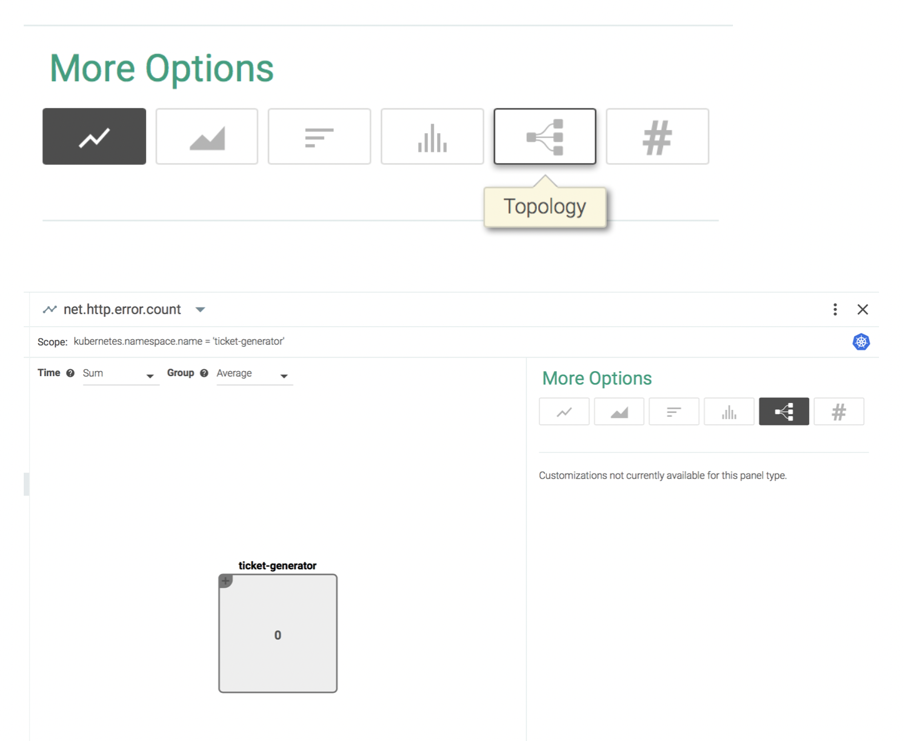
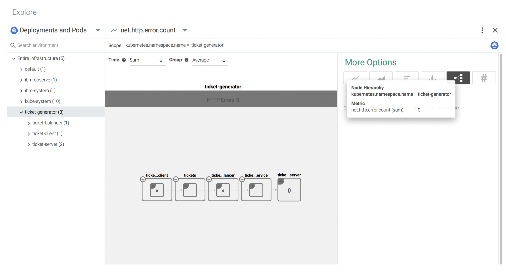
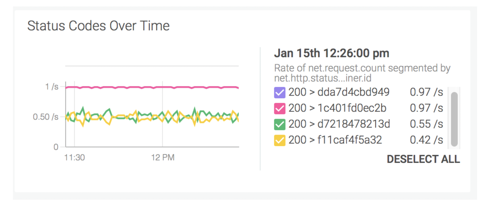

## Detect error conditions {#detect-error-conditions}

You can monitor the following **metric net.http.error.count** to detect error conditions in your application. With this metric, you monitor the number of failed HTTP requests.

**NOTE**: This metric is a good candidate to set up an alert condition. In a follow up step, you will learn how to set an alert.

### 1. Look for the metric net.http.error.count{#1}

1. From the _Explore_ tab, select **Deployments and Pods.**

2. Select the namespace **ticket-generator.**

3. Click .

4. Select **Metrics** &gt; **Network**.

5.  Select **net.http.error.count**.

### 2. Segment data by hostname{#2}

Segment the data by hostname.

Choose **host.hostname** in the **Segment by** field.

The metric panel opens and displays data segmented by hostname. If you hover over the colour line in the graph, you get the legend with the hostnames whose data is being displayed.

### 3. What can you do if the metric reports a number greater than 0 for any hostname{#3}

Look at data for the **net.http.error.count** metric view from a different angle.

Select **More Options**.

Select **Topology** view.

Then, expand the ticket-generator box to see in which component of the application you are receiving responses with error codes:

You can also go back to the **HTTP dashboard** and check the **panel Status Codes Over Time** that represents the metric **net.http.statusCode.** This metric reports the response status codes from the application HTTP requests.

