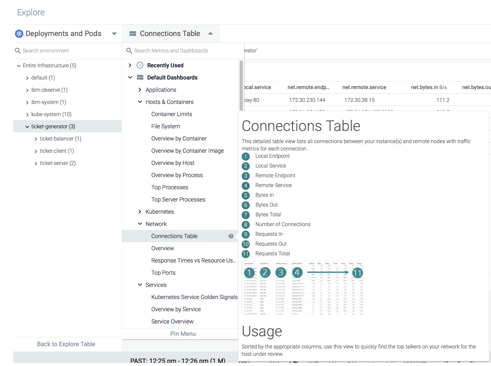
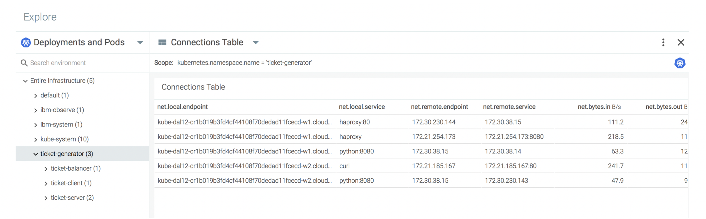

# Monitor data flow through your application components {#monitor-data-flow-through-your-application-components}

You can use the **Connection Table** dashboard to monitor how data flows between your application components.

1. From the _Explore_ tab, select **Deployments and Pods.**

2. Select the namespace **ticket-generator.**

3. Click .

4. Select **Default Dashboards** > **Network**.

5. Select **Connections Table**.

The dashboard opens. Look at the different columns and the data.

You can see the different processes inside the pods:

* The curl process that accesses the load balancer service IP through port 80.
* The HAproxy process that access the backend service IP through port 8080.
* The python backend service that listens in the 8080 port.

You can also see the number of connections, ingress and egress bandwidth of all these communication channels.
