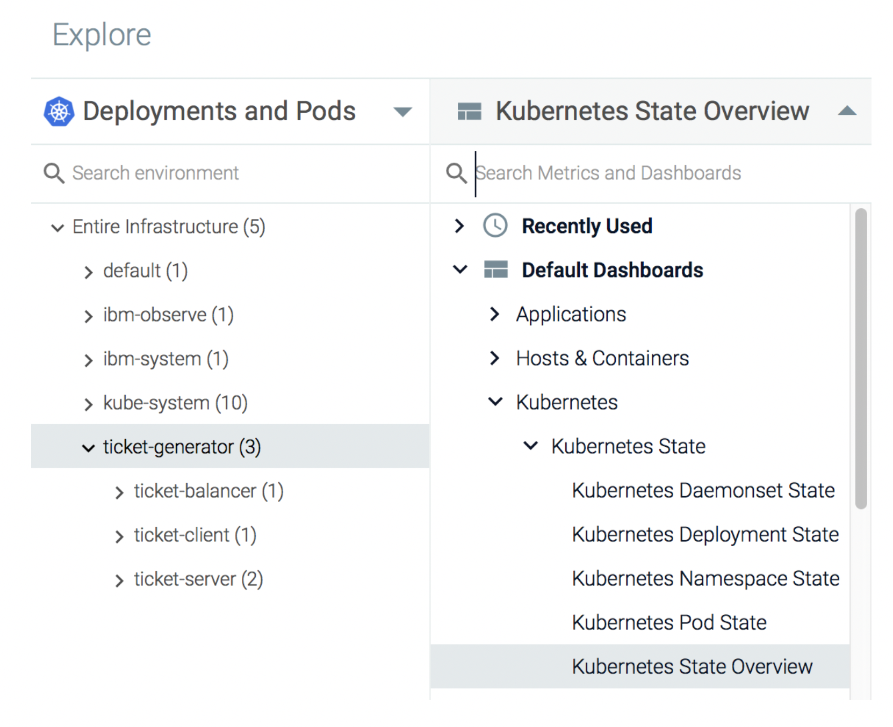
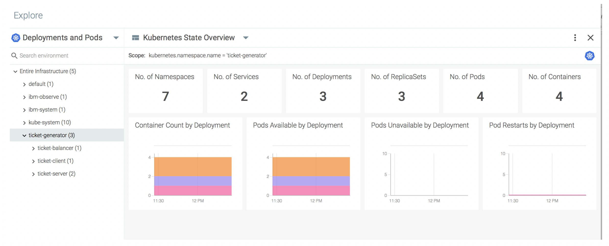

# Monitor the Kubernetes namespace where the application is running {#monitor-the-kubernetes-namespace-where-the-application-is-running}

Sysdig collects the kube-state-metrics out of the box. These metrics provide full insight about the state of your Kubernetes cluster. For example, these metrics can tell you:

* The number of instances that are running.
* The status of the pods. Are the pods running, available and ready?
* Which entities compose the application namespace. Are they up and running?

You can use the **Kubernetes State Overview** dashboard to monitor your Kubernetes cluster.

1. From the _Explore_ tab, select **Deployments and Pods.**

2. Select the namespace **ticket-generator**.

3. Click .

4. Select **Default Dashboards** &gt; **Kubernetes**.

5. Select **Kubernetes State** &gt; **Kubernetes State Overview**.

The page opens:

From these dashboard, you can see the number of containers, pods, deployments, services, etc. You can also detect if any of your pods is restarting frequently or currently unavailable.
