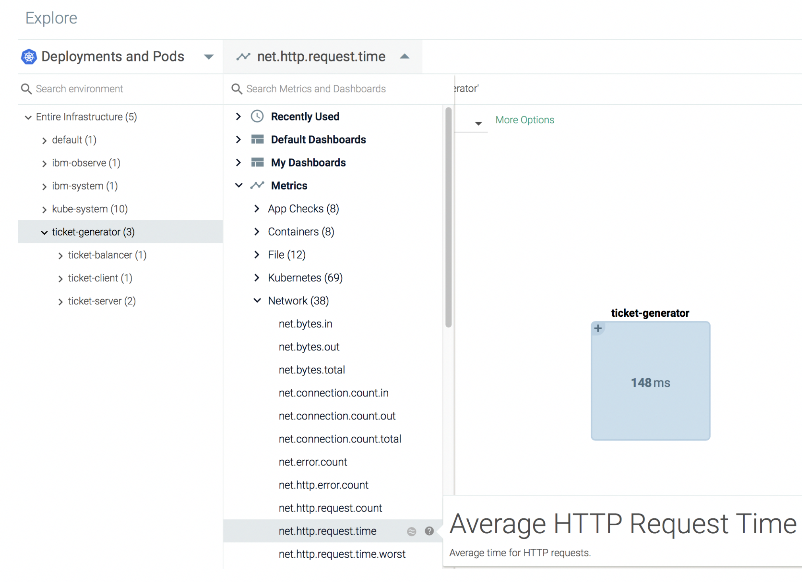
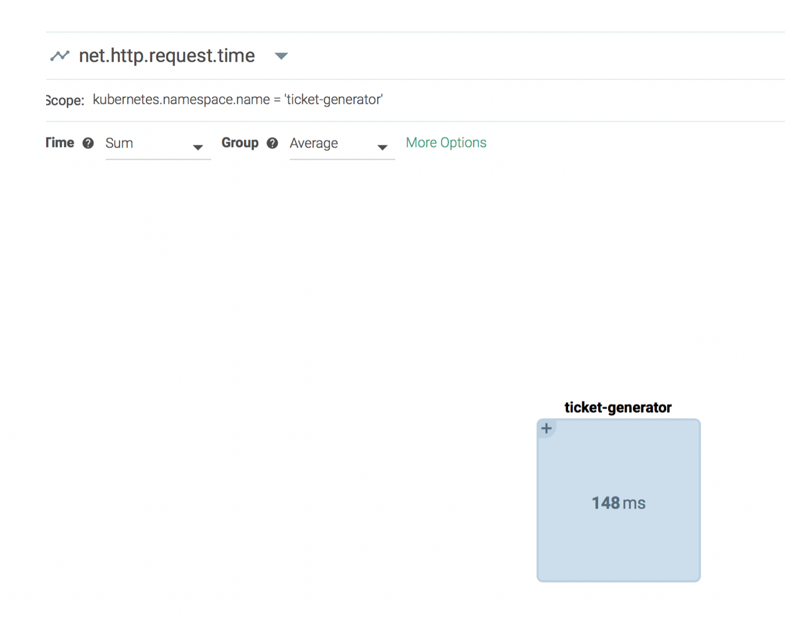
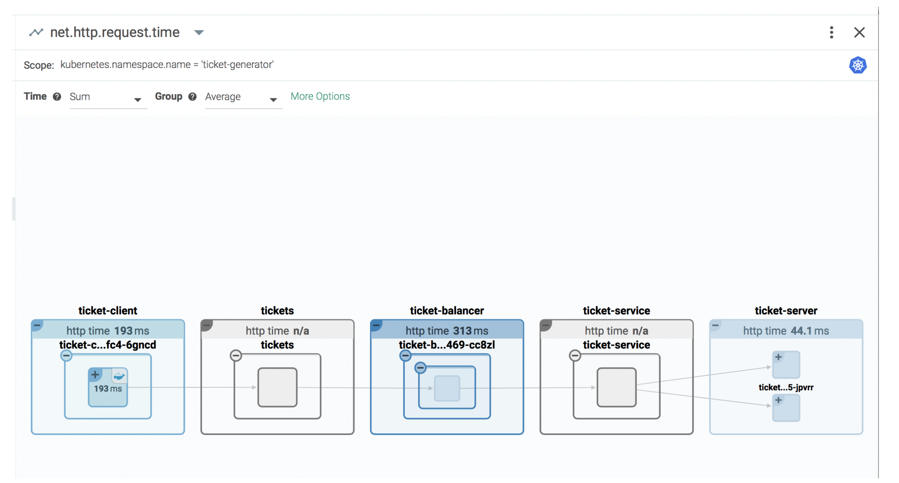

## Monitor the latency of the application {#monitor-the-latency-of-the-application}

You can monitor the following **metric net.http.request.time** to monitor the latency of the application. This metric reports average HTTP request times. You can use it to monitor the responsiveness of your application.

1. From the _Explore_ tab, select **Deployments and Pods.**

2. Select the namespace **ticket-generator.**

3. Click .

4. Select **Metrics** &gt; **Network**.

5.  Select **net.http.request.time.**

Expand the ticket-generator box.

You can see the response times for requests per component:

