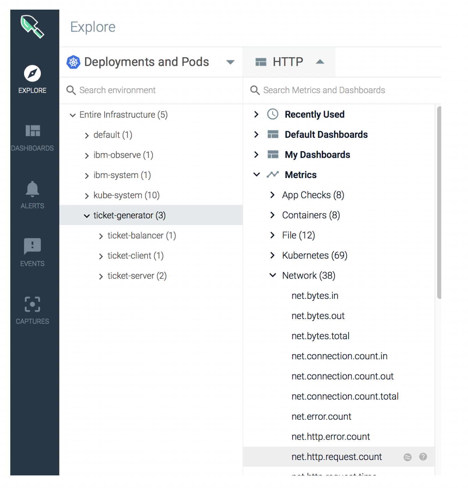
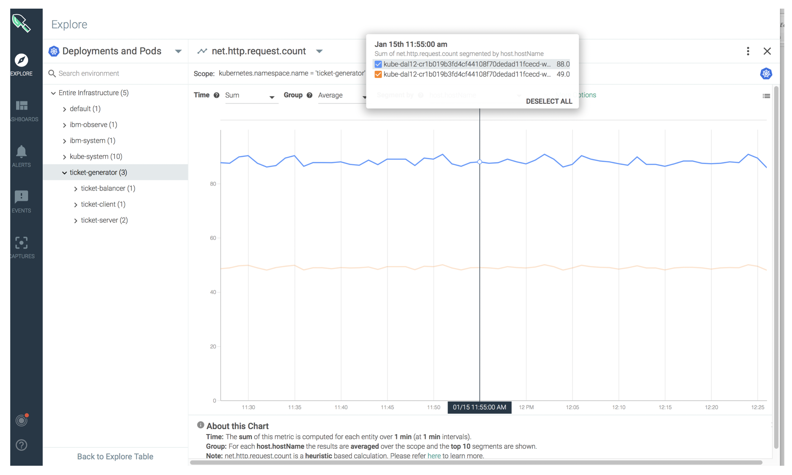

# Monitor the throughput of the application {#monitor-the-throughput-of-the-application}

You can monitor the **metric** **request count (net.http.request.count)** to measure the current throughput of the application.

1. From the _Explore_ tab, select **Deployments and Pods.**

2. Select the namespace **ticket-generator.**

3. Click .

4. Select **Metrics** > **Network**.

5. Select **net.http.request.count**.

The metric panel opens:

