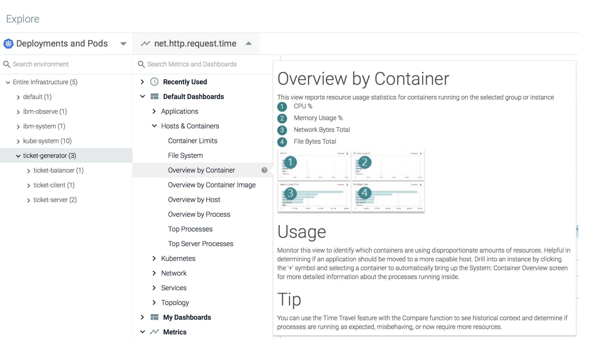
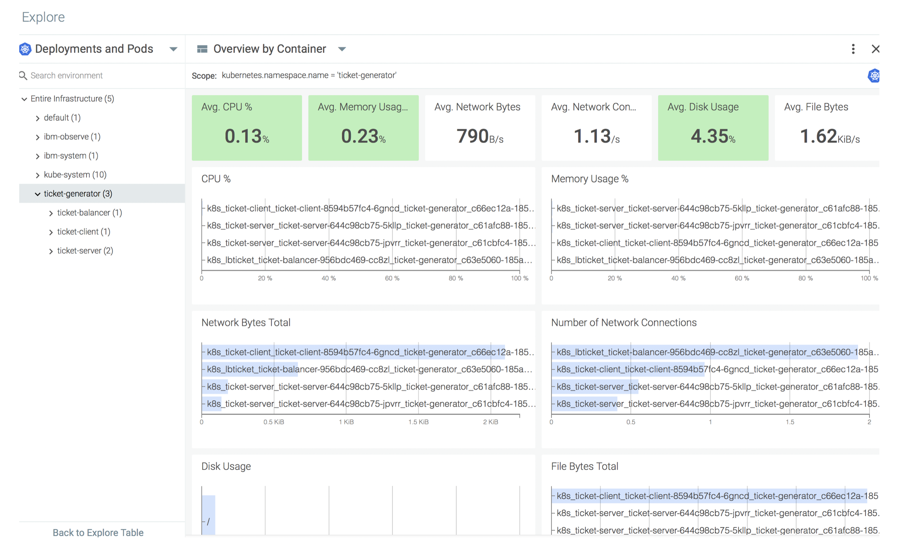

# Utilization, Saturations and Errors - USE-style overview of your namespace {#utilization-saturations-and-errors-use-style-overview-of-your-namespace}

You can use the **Overview by container** dashboard to get a USE-style overview (CPU usage, disk usage, memory usage, and more).

Complete the following steps to see the aggregated view of all containers running in the application namespace:

1. From the _Explore_ tab, select **Deployments and Pods.**

2. Select the namespace **ticket-generator** to scope the data in the dashboard to data related to the application namespace.

3. Click .

4. Select **Default Dashboards** > **Host and Containers**.

5. Select **Overview by container**.

The dashboard opens.

