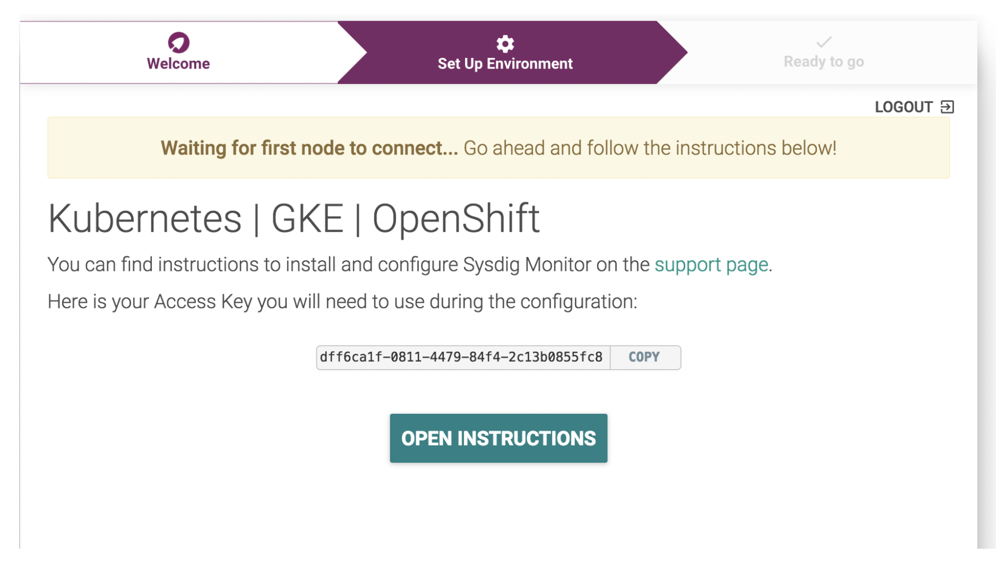
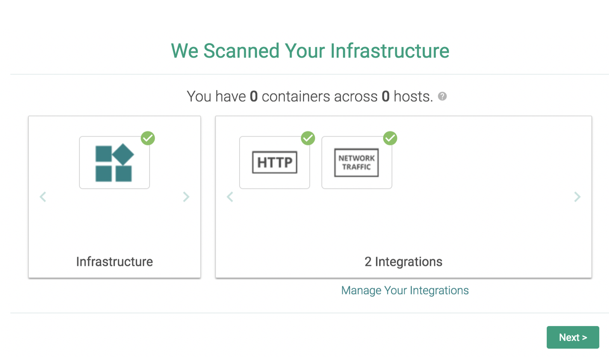

# Navigate to the Sysdig web UI {#navigate-to-the-sysdig-web-ui}

You launch the Sysdig web UI within the context of an IBM Cloud Monitoring with Sysdig instance, from the IBM Cloud Observability dashboard.

Complete the following steps to launch the web UI:

## 1. Log in to IBM Cloud{#1}

Log in to IBM Cloud. Run the following command:

```bash
ibmcloud login -a api.ng.bluemix.net
```

**Note**: If you have a federated ID, use `ibmcloud login --sso` to log in to the IBM Cloud.

After you log in with your user ID and password, the IBM Cloud Dashboard opens.

## 2. Launch the IBM Cloud observability dashboard{#2}

From the navigation menu,


select **Observability**  > **Monitoring**.

The list of monitoring instances that are available on IBM Cloud is displayed.

## 3. Launch the Sysdig web UI{#3}

From the *Observability* monitoring dashboard, select one instance. Then, click **View Sysdig**.


The **Welcome to Sysdig Monitor page** opens.


**Notice that the rest of the steps in this section are only displayed the first time you provision the instance and are required to complete the setup to access the Sysdig web UI.**

Click **NEXT**. The following page opens:


Select **Kubernetes | GKE | OpenShift**.

If you get the following page, wait for a few minutes while the agent is detected.



When the agent is recognized, you get the following page:


Click **GO TO NEXT STEP!** The agents that you have configured have been validated and are ready for business.

Click **LET’S GET STARTED** to continue.


Click **Next**.



Click Complete Onboarding.


The Sysdig UI is ready for business.


### Next{#4}

Explore the web UI, and familiarize yourself with the different modules: Explore, Dashboards, Alerts, Events, Captures

For example, in the Explore module, you can see the predefined groups that you can start to use to monitor your cluster:


Choose **Cluster and Nodes** and have a look at the information that is available out-of-the-box.


Choose **Services** and look at the Sysdig agents.


