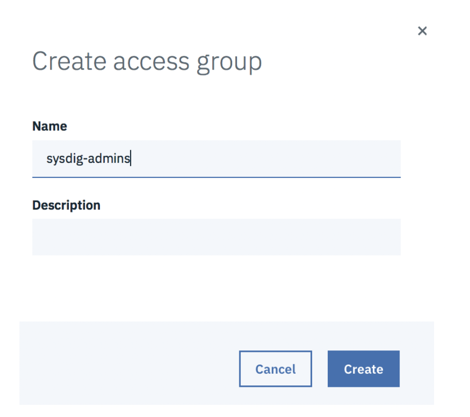
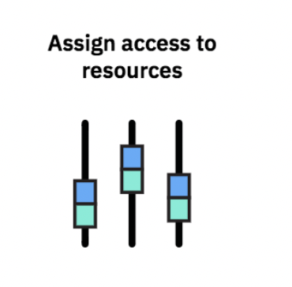
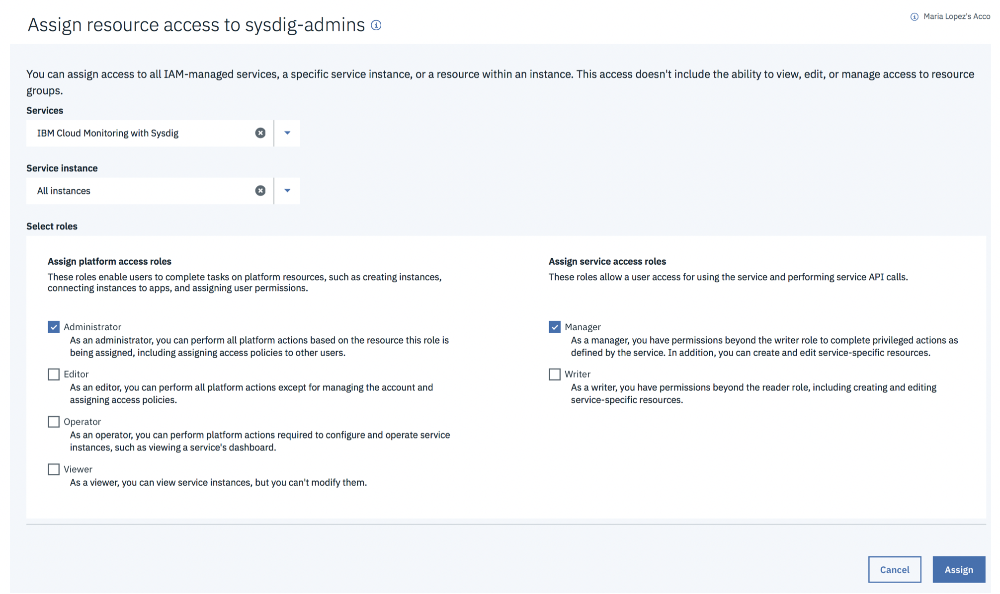

## Step 1: Grant your user permissions to provision an instance in the IBM Cloud {#step-1-grant-your-user-permissions-to-provision-an-instance-in-the-ibm-cloud}

**Note:** This step must be completed by the account owner or an administrator of the IBM Cloud Monitoring with Sysdig service on the IBM Cloud.

Complete the following steps to assign a user administrator role to the IBM Cloud Monitoring with Sysdig service:

### 1. Create the access group **logdna-admins**{#1}

1. From the menu bar, click **Manage** &gt; **Access (IAM)**.

2. Create an access group: logdna-admins  
        
    a. Select **Access Groups**.

    b. Click **Create**.

    c. Enter the name of the access group: **sysdig-admins**

    d. [Optional] Enter a description.

### 2. Add an access policy for the resource group where you are going to provision the IBM Cloud Monitoring with Sysdig service{#2}

From the access group dashboard, complete the following steps:

1. Click **Access Policies**.

2. Click **Assign Access**.

3. Select **Assign Access within a Resource Group**.

    

4. Select the name of the resource group. Choose **Default**. 

    Note: You can use any other resource group where you have permissions in the account.

5. Select the role. Choose **Administrator**.

    

6. Click **Assign**.

### 3. Add an access policy to work with the IBM Cloud Monitoring with Sysdig service{#3}

From the access group dashboard, complete the following steps:

1. Click **Access Policies**.

2. Click **Assign Access**.

3. Select **Assign Access to resources**.

    

4. Select **IBM Cloud Monitoring with Sysdig**.

5. Select **All instances**.

6. Select **administrator** role for the platform role.

7. Select **manager** role for the service role.

8. Click **Assign**.

### 4. Grant your user ID permissions{#4}

1. Click **Add users**.

2. Choose your IBM ID.

3. Click **Add to group**.

