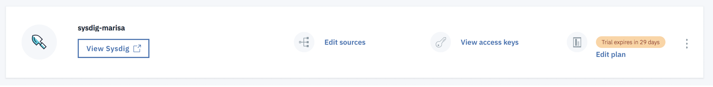

# Step 2: Provisioning an instance from the Observability dashboard {#step-2-provisioning-an-instance-from-the-observability-dashboard}

To provision an instance of IBM Cloud Monitoring with Sysdig by using the IBM Cloud UI, complete the following steps:

## 1.  Log in to your IBM Cloud account{#1}

Log in to your IBM Cloud account

The IBM Cloud dashboard can be found at: <https://cloud.ibm.com>

After you log in with your user ID and password, the IBM Cloud UI opens.

### 2. Launch the Observability page{#2}

1. Click the Navigation Menu.

    

2. Select Observability.

    

### 3. Create a monitoring instance{#3}

From the Observability page, click **Create monitoring instance**.

Enter a name for the service instance. For example, _sysdig-marisa_

Select a resource group. By default, the **Default** resource group is set.

You can select the **Default** resource group or a different one.

**Note:** If you cannot see a resource group or if you are not able to select a specific resource group, check that you have editing permissions on the resource group where you want to provision the instance.

Select the **Trial** service plan. By default, the **Trial** plan is set.

Click **Create**.

After you provision an instance, the _Observability_ dashboard opens.

Next, configure a Sysdig agent. This agent is responsible for collecting and forwarding metrics to Sysdig.
