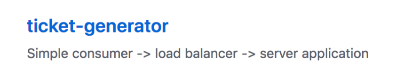
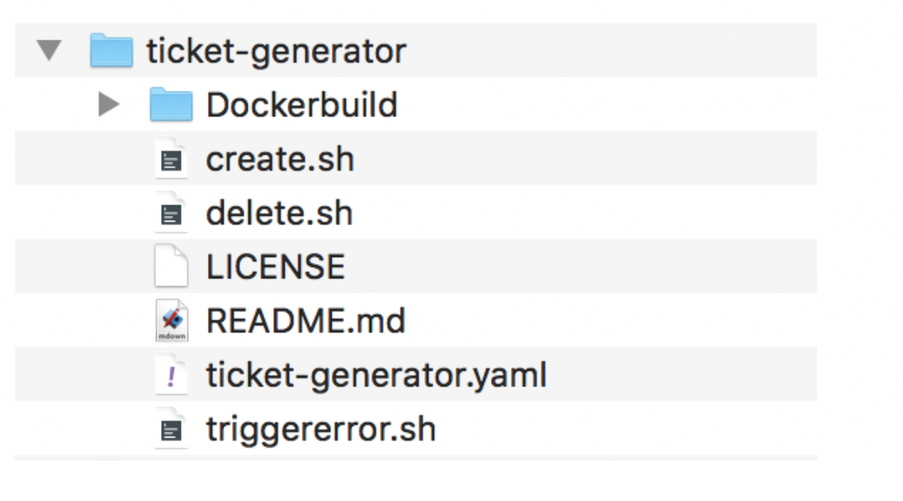

## Download the sample application {#download-the-sample-application}

From the following URL: [https://github.com/sysdiglabs](https://github.com/sysdiglabs), look for the application **ticket-generator:**



From a terminal, clone the sample application. Run the following command:

```
git clone https://github.com/sysdiglabs/ticket-generator.git
```

