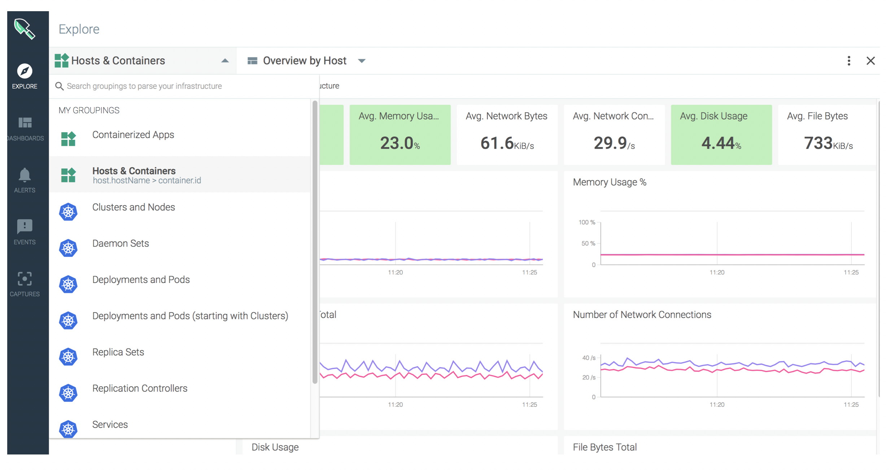
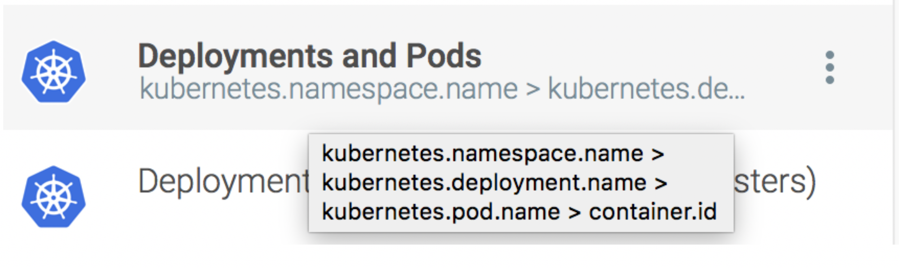
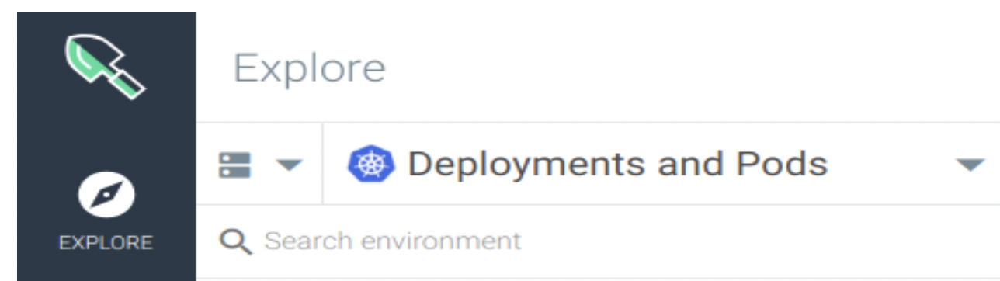
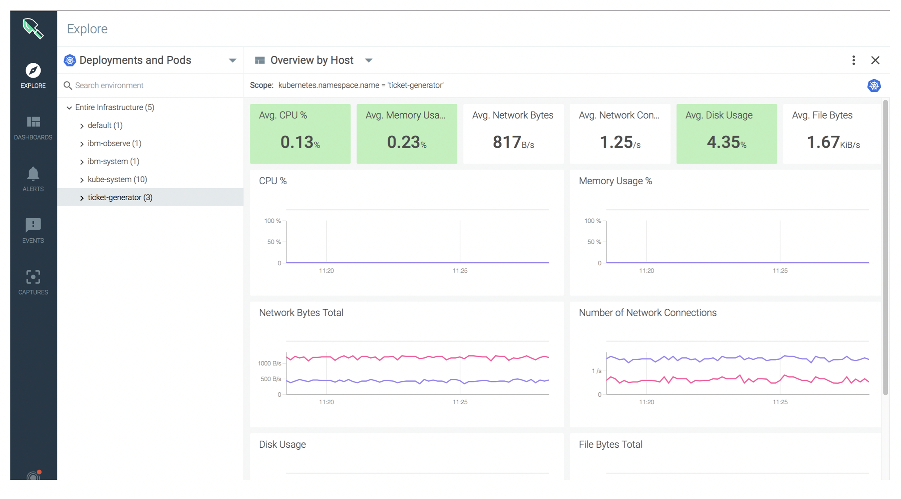
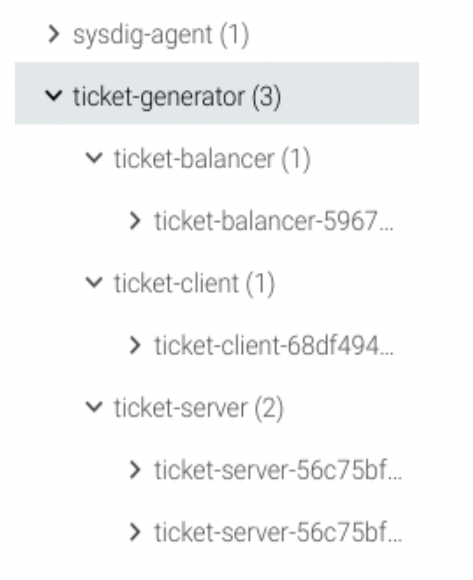

## Explore the application through the Explore tab of the Sysdig web UI {#explore-the-application-through-the-explore-tab-of-the-sysdig-web-ui}

When you launch the Sysdig web UI, the _EXPLORE_ tab opens by default.



The _EXPLORE_ tab offers you an inventory overview where you can group the different entities using physical attributes like host id or logical attributes like pods, inside deployments, inside Kubernetes namespaces. You can use a pre-defined group, or you can create your own custom one.

For example, if you choose **Deployments and Pods**, you can see data grouped by

```
kubernetes.namespace.name > kubernetes.deployment.name > lubernetes.pod.name > container.id
```



Once you select the desired grouping, you can monitor a single metric or a complete Dashboard.

Change the grouping view to **_Deployments and Pods_**



Wait until you can see the ticket-generator namespace and the 3 deployments and 4 pods that make it up:



Expand ticket-generator. You should see the following:

