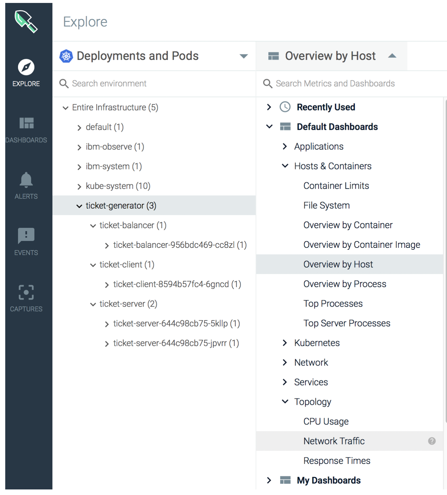
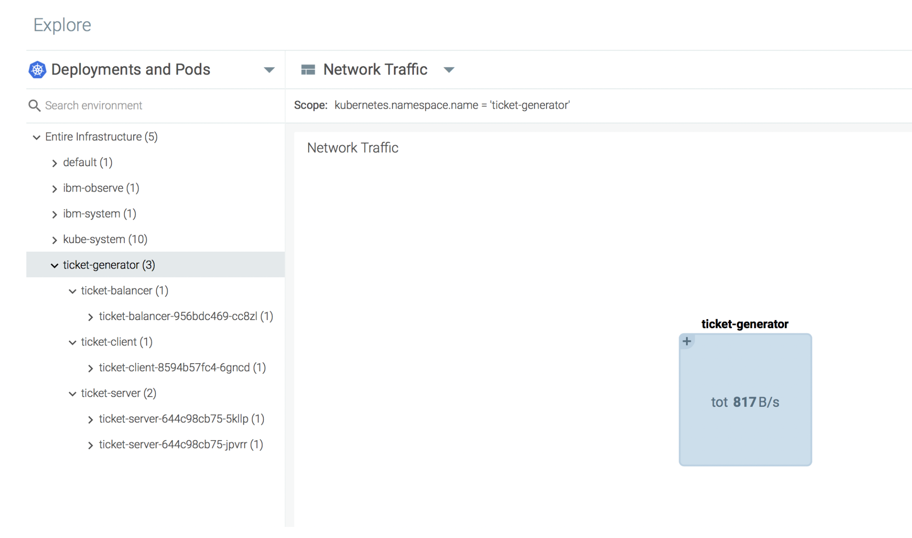
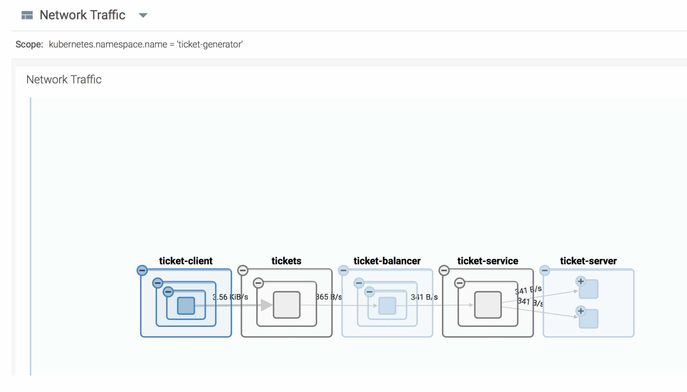

## Explore the normal traffic flow of the application {#explore-the-normal-traffic-flow-of-the-application}

The normal traffic flow of the application should be:

```
Ticket client -> Load Balancer service -> Load Balancer Pod -> Backend service -> Backend pods
```

You should be able to see this flow by completing the following steps:

1. In the Explore tab, select the **ticket-generator** namespace.
2. Click **Overview by Host**. Then, select **Topology**.
3. Expand Topology, and select **Network Traffic**.



The Network Traffic default dashboard opens.



Click the `+` symbol. Then, double click the image to enlarge it, until you see the following:



**What does the diagram tell you?**
 A ‘ticket’ client requests a new ticket to the load balancer frontend, and this balancer forwards the requests to the two backend server pods. All these pods communicate using HTTP REST-style requests.