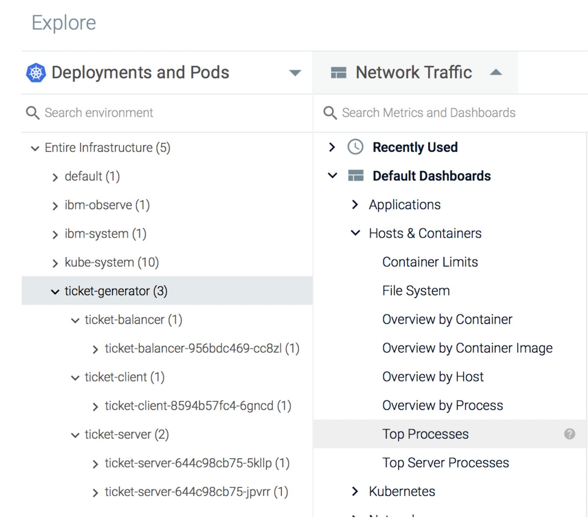
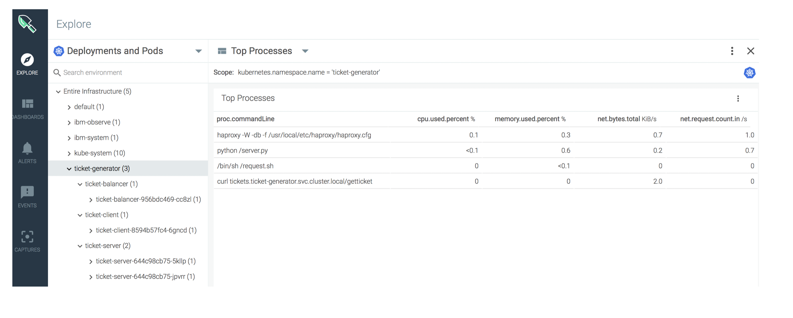
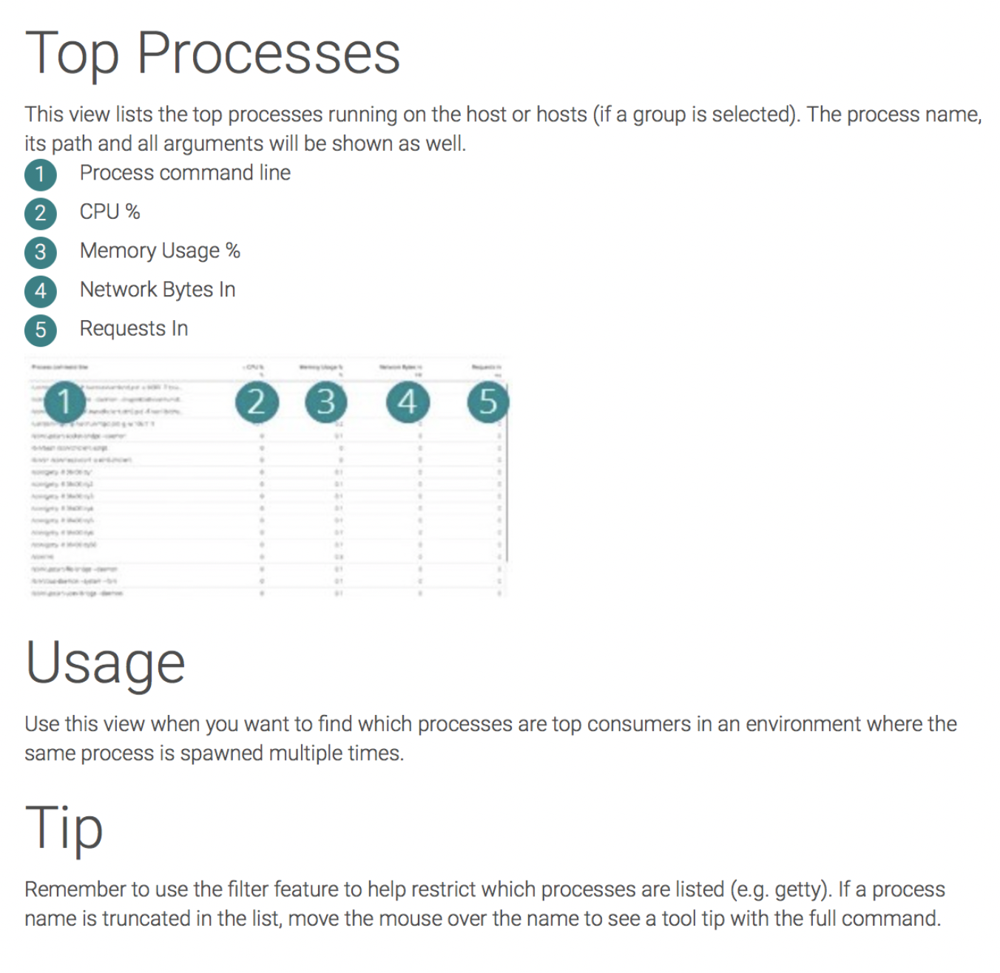
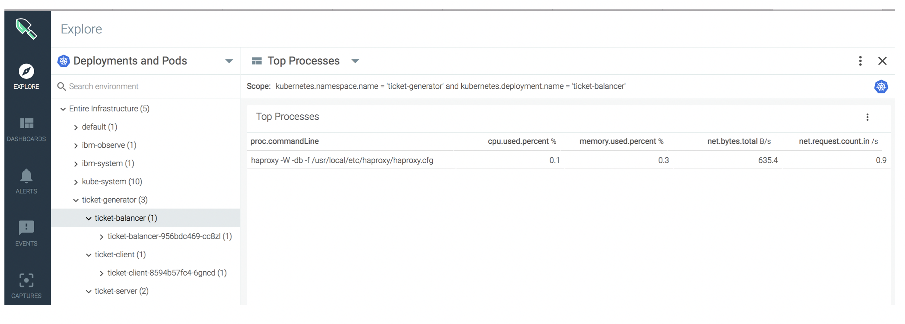

## Explore which processes are running in each container {#explore-which-processes-are-running-in-each-container}

In the *Explore* tab, select the **ticket-generator** namespace.

Click .

Select **Hosts &amp; Containers**.

Expand _Hosts &amp; Containers_, and select **Top Processes**.

The following pre-defined dashboard opens:

In these dashboard, you can see the top processes that are running on the ticket-generator namespace.

To see the top processes in the ticket-balancer, select it:

