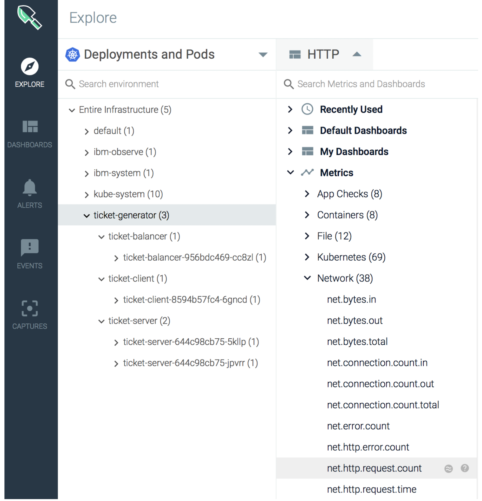
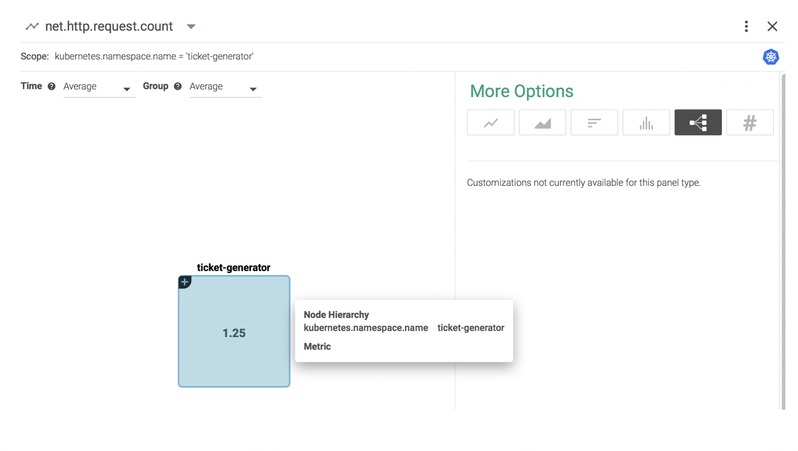

# Identify the communication patterns between the different pods {#identify-the-communication-patterns-between-the-different-pods}

To identify the communication patterns between the different pods., you can segment a single metric like **net.http.request.count** by **container.name**.

The HTTP request count metric counts the number of HTTP requests.

## 1. View the HTTP request count metric{#1}

Complete the following steps in the *Explore* tab:

Select **Deployment and Pods**.

Select the namespace **ticket-generator**.

Click .

Select **Metrics** > **Network** > **net.http.request.count**

The metric panel shows.

### 2. Segment the data by **container.id**{#2}

Look for the field **Segmented by**.

Search and select the **container.id** label.

The metric displays the average value for each container ID:

### Get a topology perspective of the data to see each pod and how it interacts{#3}

Select **More options**.

Choose **Topology.**

The panel changes and displays the following view:

Expand **ticket-generator** and double click it to enlarge it:

You can see the value of HTTP requests per container ID and their communication pattern.
